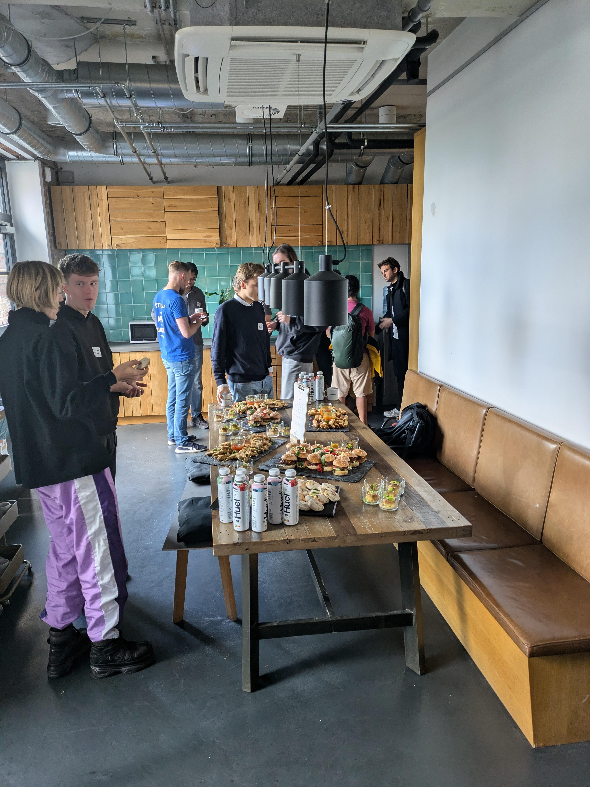

# A Weekend of Wonders: Our Hackathon Adventure

As I found myself amidst the bustling crowd at Factory Berlin, I couldn't help but feel a sense of exhilaration. The air was filled with the hum of anticipation, the clinking of glasses, and the aroma of freshly baked bread. Yes, you read that right—bread. Way too much of it, in fact. But I digress.

The hackathon was in full swing, and the participants were a motley crew of tech enthusiasts, each bringing their unique skills and ideas to the table. Literally, in our case, as we gathered around a laden buffet during lunch. The woman in the black jacket and pink pants was regaling us with tales of her latest project, while the man in the black jacket and jeans was debating the merits of different coding languages. It was a symphony of conversation, laughter, and the occasional crumb flying through the air.

Emanuel, one of the organizers, took the stage to deliver the introductory speech. Standing in front of the Factory Berlin sign, he welcomed us, introduced the sponsors—Mistral, LumaAI, and Weviate—and outlined the timeline for the weekend. His enthusiasm was infectious, and as he spoke, I could feel the energy in the room shift. We were no longer just a bunch of strangers; we were a team, ready to tackle the challenges ahead.

Our team—Jonathan, Axel, and I—had a mission: to build something incredible with LLMs (Large Language Models) and AI. We huddled together, brains buzzing with ideas, and started to map out our plan. The whiteboard became our canvas, filled with diagrams and technical jargon that only a true nerd could love. It was our roadmap, guiding us through the labyrinth of code and models.

Jonathan, with his long hair and intense focus, was the coding maestro of our group. He sat in our little haven—a room with brick walls and large windows—and worked tirelessly on his laptop. His fingers danced across the keyboard as he brought our creation, JournalAIst, to life. It was fascinating to watch him in action, like a conductor leading an orchestra of code.

As the weekend wore on, we encountered challenges. Streamlit, the platform we chose to build our app, had a learning curve as steep as a Himalayan peak. But we persevered, gluing together different models and crafting prompts that would make even the most seasoned writer weep with envy.

One of the most impressive projects I saw was a real-time translation app that could interpret multiple languages simultaneously. It was like something out of a sci-fi movie, and it served as a reminder that we were part of something truly special.

The tools and resources available were astonishing. LLMs have come a long way, and with companies like Mistral offering such powerful models, it's easier than ever to dive into the world of AI. Yet, despite the simplicity, there's still a thrill in overcoming the challenges, in making something work when it seems like it never will.

Our little haven was a sanctuary amidst the chaos, a place where we could retreat, recharge, and brainstorm. It was a stark contrast to the rest of the hackathon space, which was a whirlwind of activity, laughter, and the occasional meltdown. But even in the midst of that chaos, there was a sense of camaraderie, of shared purpose.

As I look back on the weekend, I'm filled with a sense of awe and gratitude. Awe at the incredible things we can accomplish when we put our minds to it, and gratitude for the people I met, the experiences I had, and the bread—yes, even the bread. Because in the end, it's not just about the technology or the project; it's about the people, the journey, and the stories we tell along the way.

And with that, I sign off, ready to tackle the next adventure, whatever it may be. After all, as they say, the only limit is your imagination. And perhaps your tolerance for bread.