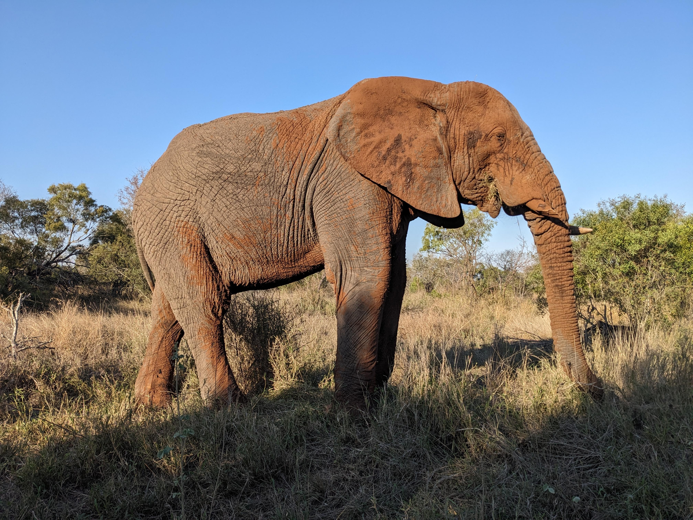
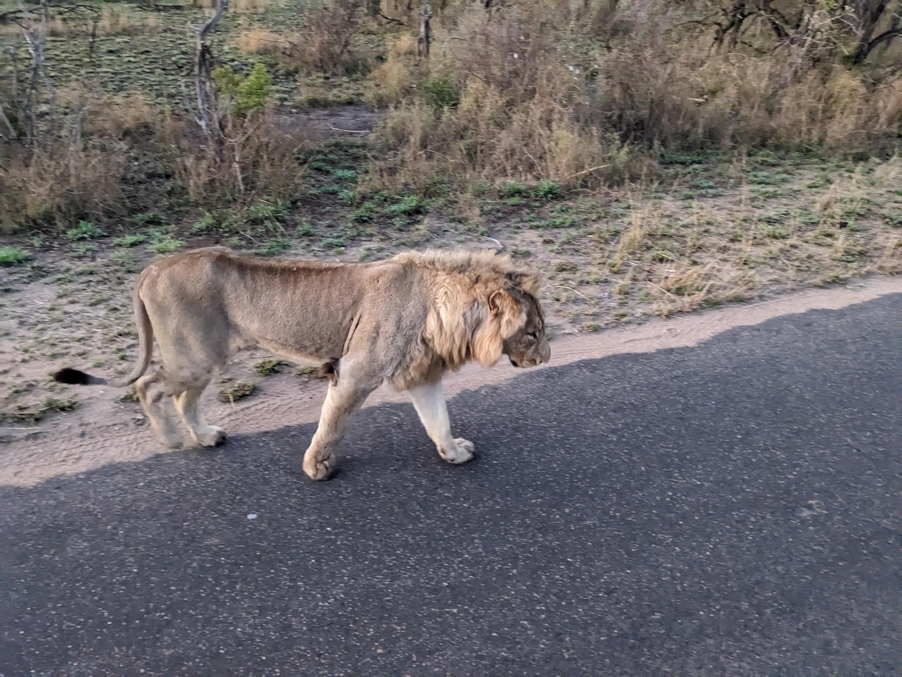

## A Wild Rendezvous in Kruger National Park

October 2023 – a month that will forever be etched in my memory, thanks to an unforgettable escapade in the heart of South Africa's Kruger National Park. Accompanied by my trusty companions, Taylor and Peter, we embarked on a journey that was equal parts thrilling, hilarious, and profoundly awe-inspiring.

The adventure began at the Tamboti Tented Camp, a place where the line between civilization and the wild blurred beautifully. Our tents were nestled amidst a symphony of nature's sounds – a lullaby of chirping birds, rustling leaves, and the occasional distant roar that sent a delightful shiver down our spines. Choosing Tamboti was no accident; we sought an experience that would bring us as close to nature as possible, and boy, did it deliver.

Our first brush with the wild was a sight to behold. There, standing majestically amidst the grassy savannah, was an elephant – a colossal beast that commanded respect with its mere presence.  It was a moment of pure awe, a reminder of the incredible diversity of life that thrives in this corner of the world.

But the show didn't stop there. As we ventured deeper into the park, we encountered a pair of zebras, their stripes blending seamlessly with the landscape.  There was something almost poetic about their presence, a testament to the harmony that exists within the wild.

The pièce de résistance, however, was the sighting of a lion. This king of the jungle casually strolled across a paved road, owning every inch of his territory.  It was a moment of raw, unfiltered power – a sight that left us speechless and humbled.

Yet, the highlight of our trip was undoubtedly the sunrise hike. Guided by the park's experienced game rangers, we navigated through the bush, every step a dance with the unknown. And there, in the heart of the wilderness, we stumbled upon a hippo, casually chilling in a watering hole. It was a sight that left us in stitches – a massive, lumbering creature enjoying a morning dip, oblivious to the spectacle it created.

The trip to Kruger National Park was more than just a vacation; it was a journey of discovery, laughter, and a deep appreciation for the natural world. It was a reminder that in the grand scheme of things, we are but tiny specks in a vast, interconnected web of life. And as I look back on those memories, I am filled with gratitude – for the experiences, the friendships, and the wild, unpredictable beauty of nature.

So, if you ever find yourself pondering a trip to Kruger National Park, take the plunge. Embrace the wild, for it is an adventure that will leave you richer in ways you can't even imagine.

<video src="7b220e34-348c-4f2d-9e80-d998076c7aa4.mp4" width="1360" height="752" controls></video>
