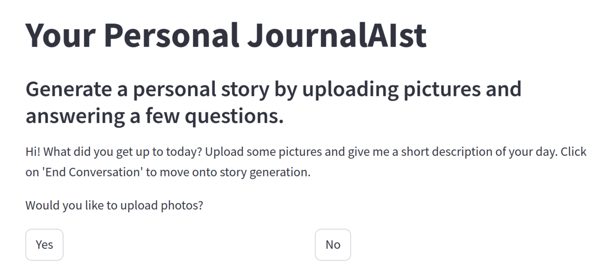

This past weekend I participated in a AI hackathon organized by [Factory Network](https://factory.network/) and [{Tech: Berlin}](https://www.techberlin.io/) with my friends Axel Nordfeldt and [Jonathan Nye](https://denyed.xyz/). The sponsors were [Mistral](https://mistral.ai/), [Weaviate](https://weaviate.io/) and [LumaAI](https://lumalabs.ai/), meaning we had a bunch of fun credits to play around with. 

I'm an ML engineer, but I haven't had that much exposure to the world brave new world of AI engineering that consists of calling LLM API's and prompt engineering, so I wanted to use the hackathon as a way to get a better understanding of which tools are out there are how people are using them. 

We spitballed a few ideas the week before the event, and eventually settled on building a kind of ghostwriter during the event. The idea wasn't to get chatbot to write you a story based on a minimal prompt, but rather to have something that interviews you in depth, and uses the interview as the basis of a blog post, short story or article.   

The idea was inspired by an experience Axel had where he went on a trip and later recounted it to a friend who is a talented writer. The friend then wrote up a summary of the trip and gave it to Axel, who was impressed by how well the friend had captured the essence of the trip. 

Writing about my own travel experiences is something I also wish I could do better. Not to for the sake of anyone else, but just for my own memories. I went to India in 2012 and I have a handful of photos of the trip, but I didn't write much down at the time. I'd love to have a more detailed account of the trip, but I can't remember all the details anymore. I recently found a [blog post](https://travelingwithbangs.wordpress.com/2012/11/05/dogs-in-darjeeling-im-jane-goodall-or-something/) by someone I had met on the trip which even includes a quote from me, which I hardly remember.   

I struggle with journaling or keeping diaries in general, so I would like to have a tool that can help me write about my experiences. I don't know if it is just because writing is hard (part of the reason I keep this blog is to practice writing), or if it is just because I feel awkward writing about myself. 

What isn't that hard however is telling someone about my experiences, especially someone who knows how to ask pertinent questions. So the idea was to build a tool that could ask you questions about an experience, and then write up a summary based on your answers. Effectively the way a ghostwriter would work, but instead of writing a book for you, it would write a blog post or short story.

## The build

For the two-day hackathon we had access to the sponsors' APIs. We especially wanted to play around with Mistral's API, which had just recently added a new multi-modal model, [Pixtral](https://mistral.ai/news/pixtral-12b/) that can understand images as well as text. 

So we basically built the app using Streamlit (called JournalAIst) as two parts: an interviewer and a writer. Basically we had a chat loop in which you could upload images (interpreted by Pixtral) and during which the interviewer model would ask you questions about your experience and the images that you added. After answering the interviewers questions for a while, you can choose to end the conversation, after which you are sent to the writer. 

The writer will then be given the transcript of your conversation, as well as Pixtral's descriptions of any images you might have uploaded. The model then uses this context to write a few paragraphs worth of text about your experience. You get to choose if you want a blog post, short story or article, each of which having a slightly different tone and viewpoint. 

We had a little bit of time left at the end so we ended up also adding a section where we fed a summary of your post to LumaAI's Dream Machine model, which generates a five second video based on this input, which was a cute little addition. Try and imagine the story that resulted in this video: 

<video src="https://github.com/user-attachments/assets/42943e30-7969-449a-bfaf-b60d463b4e3e" controls="controls" width="100%"> </video>

Getting the whole thing up and running was surprisingly easy given that none of us had any experience with Streamlit (shout-out to Vindiw Wijesooriya who's [mistral-streamlit-chat repo](https://github.com/vindiw/mistral-streamlit-chat) pointed us in the right direction). 

The story writer worked pretty well off the bat, but getting the interviewer to work well was the biggest challenge. None of us had a lot of experience prompt engineering, and the interviewer kept repeating questions (like asking who you were with three times in a row), so messing with the interviewer prompt was one of the most time consuming steps. If you have ever been interviewed by a good interviewer you know that someone skilled at the craft of interviewing can steer a conversation in interesting directions, and that is the feeling we were going for here. Easier said than done. It definitely worked best when your initial response contains quite a bit of context, hence why our initial question to the user asks for at least a few sentences. Eventually we can up with something that gave a reasonable experience, but I feel there is a lot to be done there. Maybe coming up with a set list of questions, and only having the model do follow up questions? 

We made the story writer output the story it writes as markdown so they can easily be viewed and used as blog posts. As for the images we did something janky: we saved them as `image_n.jpg` where `n` is the order in which the images were uploaded, and told the model to refer to them in that way in markdown. This felt a little weird at first, but it seems to work well enough. The model will just dump a `` in the markdown when it wanted to refer to the images, and it worked most of the time. 

## A few sample stories. 

In case you were wondering, no I din't use JournalAIst to write this blog post. The language is clearly not flowery enough. To give you an idea of the quality of the writing, here are a few samples:

### Story 1: A Wild Rendezvous in Kruger National Park
I recounted my experience of being in the [Kruger National Park](https://en.wikipedia.org/wiki/Kruger_National_Park) with a couple of friends last year. For this case I basically just threw in a handful of details and sent the model off to write. See the video at the end that we created while the LumaAI credits were still good. 

[Kruger Story 1](kruger-adventure/kruger-adventure.md)

### Story 2: A Wild Ride through Kruger: A Tale of Elephants, Lions, and Fearless Honey Badgers

[Kruger Story 2](kruger-adventure2/kruger-adventure2.md)

### Story 3: A Weekend of Wonders: Our Hackathon Adventure

[Hackathon Story](hackathon-story/hackathon-story.md)

We ended up making it to the final six teams with our project, which was a pretty cool experience.
