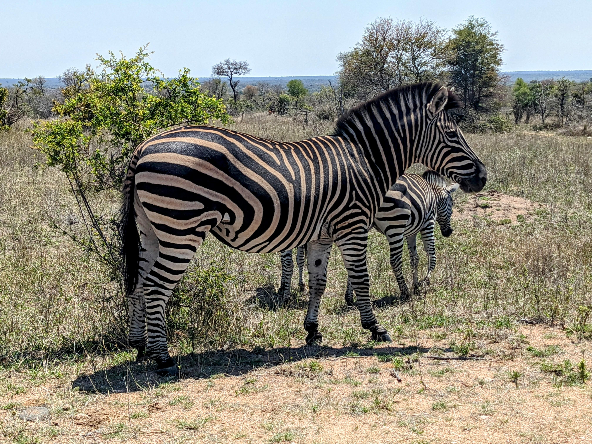
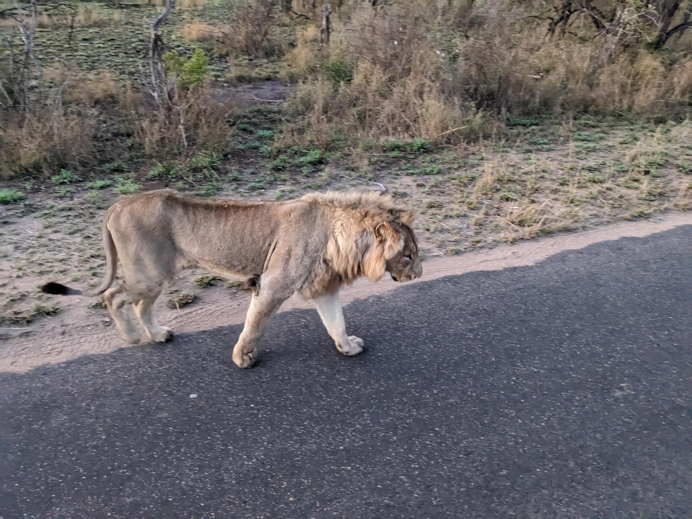

# A Wild Ride through Kruger: A Tale of Elephants, Lions, and Fearless Honey Badgers

Ah, Kruger National Park! A place where memories are made and friendships are forged in the heat of the African sun. I recently had the pleasure of venturing into this wildlife wonderland with my American amigos, Taylor and Peter. Let me tell you, it was an experience that will leave us swapping stories for years to come.

## The Giant Welcome

Our adventure began with a bang—or rather, a trumpeting roar. As we entered the park, we encountered our first elephant, a magnificent beast standing tall and proud in the grassy savannah. Now, I've seen elephants before, but it was a first for Taylor and Peter. Their eyes widened as they took in the true scale of these gentle giants. It was a sight to behold, and a perfect start to our safari.

## The Zebra Zoo

Of course, no trip to Kruger would be complete without a visit from the zebra troupe. These striped beauties were everywhere, dotting the landscape like a naturalist's paintbrush gone wild. They munched on grass, their tails swishing lazily, seemingly oblivious to the awe they inspire in us humans.

## The Royal Encounter

Now, let me tell you about the highlight of our trip—the moment that had both Taylor and Peter on the edges of their seats. We were on our way to a sunrise walk when our guide suddenly stopped the vehicle. There, in the middle of the road, were three lions, lounging like kings on their throne. These magnificent creatures were so close, we could have reached out and touched them. Well, maybe not quite, but close enough to make your heart pound. The lions paid us no mind, merely blinking lazily in the morning sun. It was a breathtaking sight, one that left us all in awe.

## The Fearless Duo

But the wildlife encounters didn't stop there. Oh no, not by a long shot. Back at our camp at Tamboti Tented Camp, we had a couple of uninvited guests. Honey badgers, to be precise. These little critters are known for their fearlessness, and they certainly lived up to their reputation. They wandered into our camp, completely unfazed by our presence, and began rummaging through the garbage bins. We tried to scare them off, but they were having none of it. Even throwing firewood near them only seemed to annoy them. It was a hilarious and somewhat terrifying spectacle all at once.

## The Rest of the Cast

Our safari was a veritable who's who of African wildlife. We spotted leopards, wild dogs, ground hornbills, and even rhinos—twice! The night drives, however, were a bit of a letdown. We did see an African wild cat, which was adorable, but that was about the extent of the excitement. Still, it was a small price to pay for the incredible experiences we had during the day.

## The Great Escape

As we packed up and prepared to leave Kruger, we couldn't help but feel a mix of exhilaration and sadness. Exhilaration for the memories we had made, and sadness for the adventure coming to an end. But as we drove out of the gates, we knew one thing for sure—we would be back. Because once you've experienced the wild beauty of Kruger, it's hard to stay away.

So, until next time, Kruger. We'll be back. And who knows what adventures await us then?