If you work in the Geospatial Machine Learning (or AI[^1]) domain, you'll know that embeddings are all the rage at the moment. I used the meme below in an internal presentation a few months ago, but I think it is relevant here: 

[^1]: It's only AI if it's from the AI region of France, otherwise it's just sparking Machine Learning. 


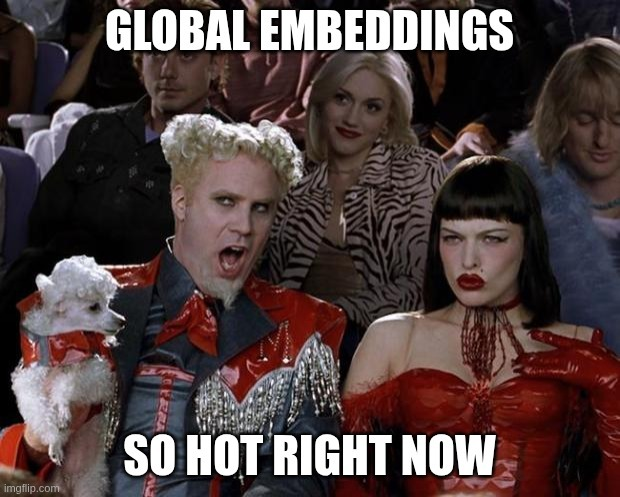{fig-align="center" width="620" height="497"}

But what exactly **are** embeddings? 

### What are embeddings? 

There is a little bit of heterogeneity in embeddings, but effectively they are compressed representations of data that have been "embedded" into some feature space, usually by a learned model. This is not unique to geospatial data, and can be done for text, images, videos, graphs, or whatever data structure you can train a model for. You might have heard of RAG (retrieval augmented generation) in the language domain, where documents are embedded by a language model, and the embeddings are stored in some way (often a vector database) from which they can be retrieved via a semantic search. A search engines image search functionality often works in a similar fashion, but using image models.  

For the geospatial case, embeddings are created by training a foundation model on large amounts of (usually) satellite data, and then embeddings are created for a large corpus of satellite data. Some examples are the embeddings created using the [Clay Foundation model](https://source.coop/clay), the [EarthIndex](https://source.coop/earthgenome/earthindexembeddings) embeddings created by EarthGenome, the [Tessera Embeddings](https://github.com/ucam-eo/geotessera), the [Major TOM](https://huggingface.co/Major-TOM) embeddings by ESA, and the ones I used today, the [AlphaEarth Foundations](https://developers.google.com/earth-engine/datasets/catalog/GOOGLE_SATELLITE_EMBEDDING_V1_ANNUAL) dataset by Google (Deepmind).   

There are some differences between all these embeddings: the sources of data are different (most use at least Sentinel-2, but often combine it with other data), and some do inference on image patches (e.g. 224x224 pixel patches of th earth), while some do it per pixel, i.e. release an embedding for every 10x10 meters on earth. The AlphaEarth dataset does the latter.  

From here on, when I talk about embeddings I will generally mean "embeddings created using a geospatial foundation model on global satellite data". 

### Why embeddings? 

Once you have embeddings, there is a actually a lot of fun stuff you can do with them. [This tutorial](https://developers.google.com/earth-engine/tutorials/community/satellite-embedding-01-introduction) on the Google Earth Engine page goes through a couple examples, ranging from similarity search, to supervised and unsupervised classification.   

Essentially, a lot of work goes into training these large foundation models, and doing inference with these models is not cheap either. See this [Github issue](https://github.com/Clay-foundation/model/issues/277) I stumbled upon where the Clay team discuss what it would cost to do an inference run for the entire world: 

| chip size (x10m/px) | cost unit (km^2/$/h/worker) | cost to run the world |
|---------------------|:---------------------------:|:---------------------:|
| 50x50 px            | 1000                        | $510K                 |
| 100x100 px          | 4000                        | $127K                 |


But once you have created the embeddings dataset, you have amortized the cost, and everything you do downstream can now benefit from the work that has been done in creating these embeddings. This allows you to cheaply do large scale calculations for a fraction of the cost of if you had to run the encoder every time. 

### 30DayMapChallenge: Day 23 - Process

Being a geospatial company, we at LiveEO are doing the 30DayMapChallenge. I've wanted an excuse to play around with embeddings a little bit more, so I thought I'd pick day 23. The theme of today is to document the process of making the map, hence this blog post.  

What I wanted to do is to see how I could use embeddings to extract some information that can be mapped. What I'm doing today is creating a change map of Berlin for the earliest and latest dates available in the AlphaEarth embeddings dataset, i.e. 2017 and 2024. 

I did this by calculating (one minus) the cosine similarity between all pixels that overlap with Berlin for 2017 and 2024, and using that too see what has changed.  

$$
\text{cosine similarity}(\mathbf{A}, \mathbf{B}) = \frac{\mathbf{A} \cdot \mathbf{B}}{\|\mathbf{A}\| \|\mathbf{B}\|} = \frac{\sum_{i=1}^{n} A_i B_i}{\sqrt{\sum_{i=1}^{n} A_i^2} \sqrt{\sum_{i=1}^{n} B_i^2}}
$$

Conceptually, embeddings that are similar will have a high cosine similarity, and embeddings that are very different will have a low cosine similarity, so by doing this we can find the places where the embeddings between 2017 and 2024 have changed the most. As the AlphaEarth embeddings have been unit normed, this means that the formula above actually simplifies to just taking the dot product, which is pretty cheap to calculate. 

Plotted, this looks like: 


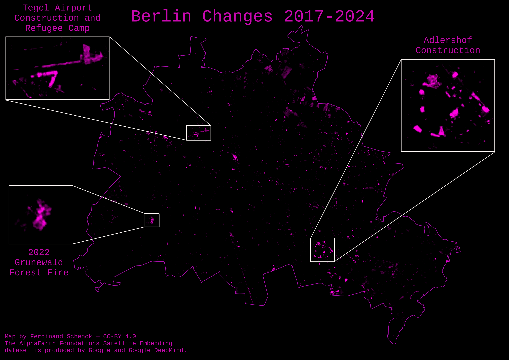

# {fig-align="center" width="620"}

As you can see, the areas with high change stand out as bright spots, while the areas with low change stay dark. 

### A few highlights

#### Adlershof
I studied in Adlershof (it hosts the science campus of HU-Berlin), and during the time I was there a lot of construction happened. Looking at the map, you can clearly see a cluster of large changes in that area:


::: {layout="[1,1,1]"}
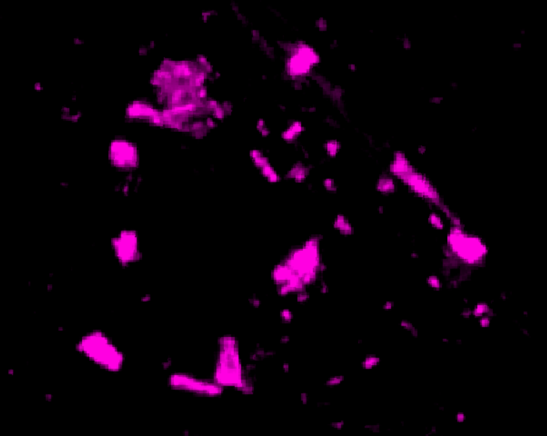

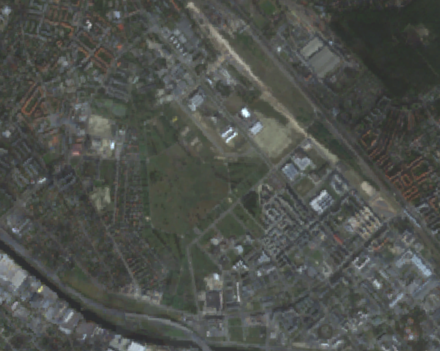

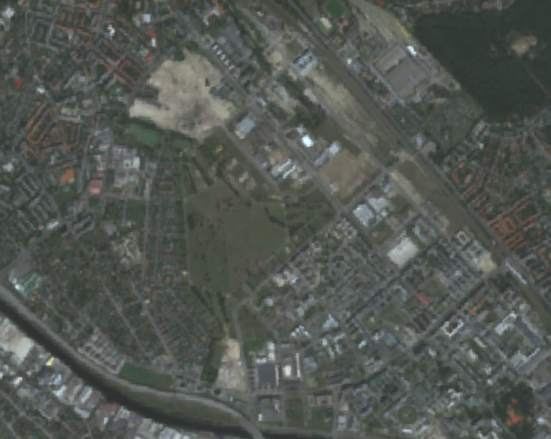
:::

According to the [Economic Affairs, Energy and Public Enterprises for Berlin](https://www.berlin.de/sen/web/en/economics-and-technology/centres-of-technology-zukunftsorte-smart-city/zukunftsorte/adlershof/artikel.597193.en.php), over half a billion Euros have been invested by the Berlin government to improve Adlershof in the last few years. 

#### Tegel

Another point that stood out was the Tegel Airport, which was shut down in 2021:

::: {layout="[1,1,1]"}
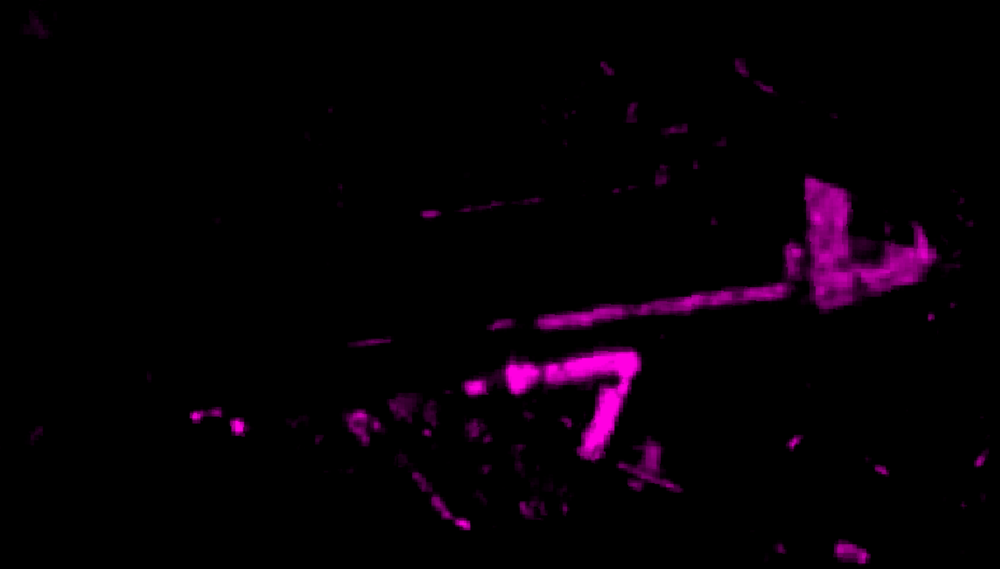

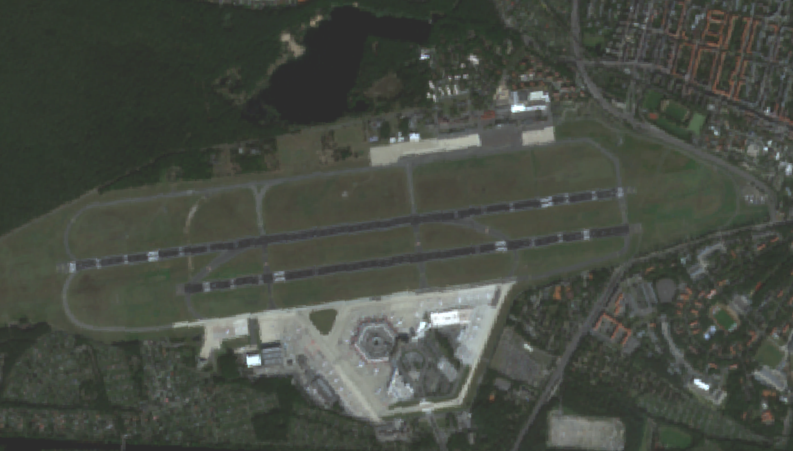

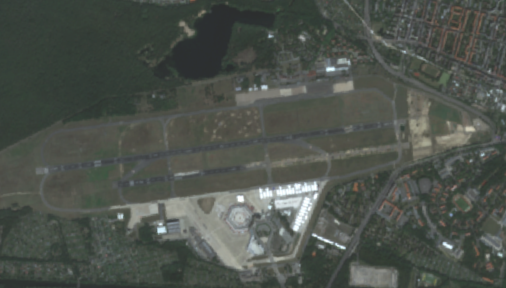
:::

The temporary buildings around the terminal are part of a [refugee camp](https://www.berlin.de/en/news/9683254-5559700-tegel-airport-to-remain-refugee-accommod.en.html) set up in 2022 to house people mostly fleeing the war in Ukraine. 

The area of the former airport is being turned into a [business hub as well as a living area](https://tegelprojekt.de/en/) with around 5000 new homes. 

I was wondering what was going on on the runway, and a quick search brought up a thread on the r/berlin subreddit asking the same question, which had this comment: 

<blockquote class="reddit-embed-bq" data-embed-height="300"><a href="https://www.reddit.com/r/berlin/comments/1io711r/comment/mci73ap/">Comment</a><br> by<a href="https://www.reddit.com/user/Dragonogard549/">u/Dragonogard549</a> from discussion<a href="https://www.reddit.com/r/berlin/comments/1io711r/foreigner_here_berlin_tegel_airport_whats/"></a><br> in<a href="https://www.reddit.com/r/berlin/">berlin</a></blockquote><script async="" src="https://embed.reddit.com/widgets.js" charset="UTF-8"></script>

So pretty much the norm for doing construction in the heavily bombed Berlin: you gotta remove the bombs before you can build new things. 

#### Grunewald

Another one that stood out to me in was a blob in the Grunewald forest in the western side of Berlin:

::: {layout="[1,1,1]"}
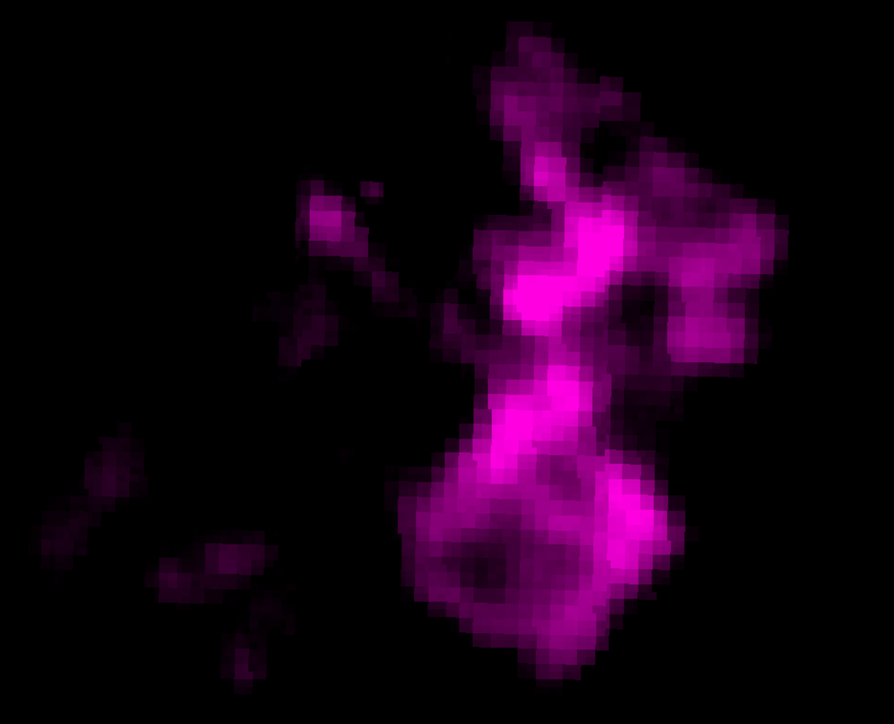

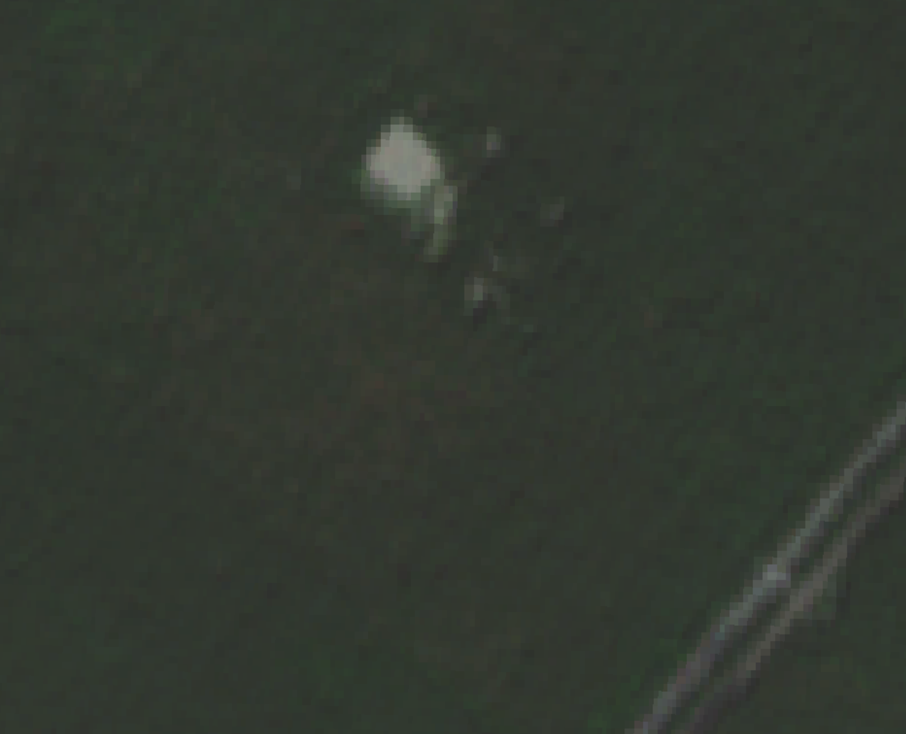

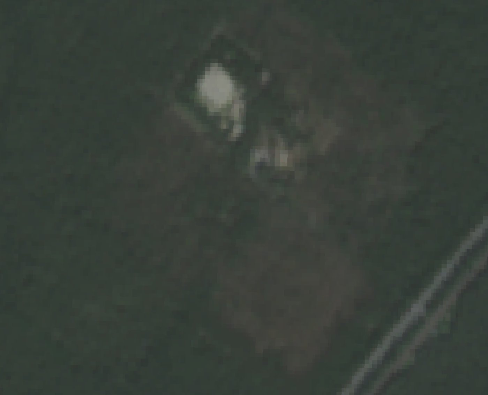
:::

It's from a large fire that occurred in 2022 when a [bomb storage site](https://www.bbc.com/news/world-europe-62426412) caught fire and sparked a fire in the forest.  


### Method

If you want to make a change map like this, it's rather easy if you have access to Google Earth Engine.

I did this in the [GEE code editor](https://code.earthengine.google.com/), but you can also call the API. 


The first step is to define the AlphaEarth Embeddings as your dataset: 

```javascript
// Load collection.
var dataset = ee.ImageCollection('GOOGLE/SATELLITE_EMBEDDING/V1/ANNUAL');
```

Next, define your AOI. You can get more complicated, by pulling in a shapefile or some other geometry, but I just took a bounding box of Berlin: 

```javascript
// Area of interest - Berlin, Germany
var aoi = ee.Geometry.Polygon([
  [
    [13.08, 52.33],  // Southwest corner
    [13.76, 52.33],  // Southeast corner
    [13.76, 52.68],  // Northeast corner
    [13.08, 52.68],  // Northwest corner
    [13.08, 52.33]   // Close the polygon
  ]
]);
```

Next, we get the embeddings for the years we are interested in. The AlphaEarth embeddings are annual, i.e. one per year, and span the range of 2017 to 2024 so far, and I hope they will continue adding these every year: 


```javascript
// Get embeddings for 2017
var startDate2017 = ee.Date.fromYMD(2017, 1, 1);
var endDate2017 = startDate2017.advance(1, 'year');
var embeddings2017 = dataset
    .filter(ee.Filter.date(startDate2017, endDate2017))
    .filter(ee.Filter.bounds(aoi))
    .mosaic();

// Get embeddings for 2024
var startDate2024 = ee.Date.fromYMD(2024, 1, 1);
var endDate2024 = startDate2024.advance(1, 'year');
var embeddings2024 = dataset
    .filter(ee.Filter.date(startDate2024, endDate2024))
    .filter(ee.Filter.bounds(aoi))
    .mosaic();
```

Next we will calculate the cosine similarity between our dates for every pixel. We define the change as $1 - \text{cosine similarity}$:  

```javascript
// Calculate cosine similarity per pixel across all 64 bands
// Note: The embeddings have unit length by design, so cosine similarity 
// simplifies to just the dot product

// Dot product: sum of element-wise multiplication across all 64 bands
var cosineSimilarity = embeddings2017.multiply(embeddings2024)
    .reduce(ee.Reducer.sum());

// Change = 1 - cosine similarity (higher values = more change)
var change = ee.Image(1).subtract(cosineSimilarity);

// Clip to AOI
var changeClipped = change.clip(aoi);

// Debug: check statistics
print('Change statistics:', changeClipped.reduceRegion({
  reducer: ee.Reducer.minMax(),
  geometry: aoi,
  scale: 1000,
  maxPixels: 1e9
}));
```

Next we want to visualize this. This is optional, as you can also at this point just export the raster, but it's helpful for testing purposes: 

```javascript
// Visualize change map
Map.addLayer(
  changeClipped,
  {min: 0, max: 0.5, palette: ['black', 'blue', 'cyan', 'yellow', 'red']},
  'Change 2017-2024 (brighter = more change)'
);

// Optional: visualize embeddings for context
var visParams = {min: -0.3, max: 0.3, bands: ['A01', 'A16', 'A09']};
Map.addLayer(embeddings2017.clip(aoi), visParams, '2017 embeddings', false);
Map.addLayer(embeddings2024.clip(aoi), visParams, '2024 embeddings', false);

Map.centerObject(aoi, 8);
Map.setOptions('SATELLITE');

```

And *voilà*, you have a change map! The code above runs in seconds!

You can export this to Google drive with: 

```javascript
// Export full change map
Export.image.toDrive({
  image: changeClipped,
  description: 'change_map_2017_2024',
  folder: 'GEE_Berlin_Analysis',
  region: aoi,
  scale: 10,
  maxPixels: 1e9,
  fileFormat: 'GeoTIFF'
});
```

And now you can visualize these changes in your favorite GIS software (I used QGIS). 

If you want the full code I used to also export the matching Sentinel-2 images, expand the code below: 

<details>
<summary>Show code</summary>
```javascript
// Load collection.
var dataset = ee.ImageCollection('GOOGLE/SATELLITE_EMBEDDING/V1/ANNUAL');

// Area of interest - Berlin, Germany
var aoi = ee.Geometry.Polygon([
  [
    [13.08, 52.33],  // Southwest corner
    [13.76, 52.33],  // Southeast corner
    [13.76, 52.68],  // Northeast corner
    [13.08, 52.68],  // Northwest corner
    [13.08, 52.33]   // Close the polygon
  ]
]);

// Get embeddings for 2017
var startDate2017 = ee.Date.fromYMD(2017, 1, 1);
var endDate2017 = startDate2017.advance(1, 'year');
var embeddings2017 = dataset
    .filter(ee.Filter.date(startDate2017, endDate2017))
    .filter(ee.Filter.bounds(aoi))
    .mosaic();

// Get embeddings for 2024
var startDate2024 = ee.Date.fromYMD(2024, 1, 1);
var endDate2024 = startDate2024.advance(1, 'year');
var embeddings2024 = dataset
    .filter(ee.Filter.date(startDate2024, endDate2024))
    .filter(ee.Filter.bounds(aoi))
    .mosaic();

// Debug: check images
print('Embeddings 2017:', embeddings2017);
print('Embeddings 2024:', embeddings2024);

// Calculate cosine similarity per pixel across all 64 bands
// Note: The embeddings have unit length by design, so cosine similarity 
// simplifies to just the dot product

// Dot product: sum of element-wise multiplication across all 64 bands
var cosineSimilarity = embeddings2017.multiply(embeddings2024)
    .reduce(ee.Reducer.sum());

// Change = 1 - cosine similarity (higher values = more change)
var change = ee.Image(1).subtract(cosineSimilarity);

// Clip to AOI
var changeClipped = change.clip(aoi);

// Debug: check statistics
print('Change statistics:', changeClipped.reduceRegion({
  reducer: ee.Reducer.minMax(),
  geometry: aoi,
  scale: 1000,
  maxPixels: 1e9
}));

// Visualize change map
Map.addLayer(
  changeClipped,
  {min: 0, max: 0.5, palette: ['black', 'blue', 'cyan', 'yellow', 'red']},
  'Change 2017-2024 (brighter = more change)'
);

// Optional: visualize embeddings for context
var visParams = {min: -0.3, max: 0.3, bands: ['A01', 'A16', 'A09']};
Map.addLayer(embeddings2017.clip(aoi), visParams, '2017 embeddings', false);
Map.addLayer(embeddings2024.clip(aoi), visParams, '2024 embeddings', false);

// Load Sentinel-2 imagery
var s2 = ee.ImageCollection('COPERNICUS/S2_SR_HARMONIZED');

// Function to mask clouds in Sentinel-2
var maskS2clouds = function(image) {
  var qa = image.select('QA60');
  var cloudBitMask = 1 << 10;
  var cirrusBitMask = 1 << 11;
  var mask = qa.bitwiseAnd(cloudBitMask).eq(0)
      .and(qa.bitwiseAnd(cirrusBitMask).eq(0));
  return image.updateMask(mask).divide(10000)
    .select(['B2', 'B3', 'B4', 'B5', 'B6', 'B7', 'B8', 'B8A', 'B11', 'B12']); // Select only these bands
};

// Get Sentinel-2 composites for 2017 and 2024
var s2_2017 = s2
    .filterDate('2017-01-01', '2018-01-01')
    .filterBounds(aoi)
    .filter(ee.Filter.lt('CLOUDY_PIXEL_PERCENTAGE', 20))
    .map(maskS2clouds)  // Now all images have same bands
    .median();

var s2_2024 = s2
    .filterDate('2024-01-01', '2025-01-01')
    .filterBounds(aoi)
    .filter(ee.Filter.lt('CLOUDY_PIXEL_PERCENTAGE', 20))
    .map(maskS2clouds)  // Now all images have same bands
    .median();

// Visualization parameters for RGB
var rgbVis = {bands: ['B4', 'B3', 'B2'], min: 0, max: 0.3};

// ADD THESE TWO LINES:
Map.addLayer(s2_2017.clip(aoi), rgbVis, 'Sentinel-2 2017', false);
Map.addLayer(s2_2024.clip(aoi), rgbVis, 'Sentinel-2 2024', false);

Map.centerObject(aoi, 8);
Map.setOptions('SATELLITE');


// Export full change map
Export.image.toDrive({
  image: changeClipped,
  description: 'change_map_2017_2024',
  folder: 'GEE_Berlin_Analysis',
  region: aoi,
  scale: 10,
  maxPixels: 1e9,
  fileFormat: 'GeoTIFF'
});

// Export Sentinel-2 2017 RGB
Export.image.toDrive({
  image: s2_2017.clip(aoi).select(['B4', 'B3', 'B2']),
  description: 'sentinel2_2017_RGB',
  folder: 'GEE_Berlin_Analysis',
  region: aoi,
  scale: 10,
  maxPixels: 1e9,
  fileFormat: 'GeoTIFF'
});

// Export Sentinel-2 2024 RGB
Export.image.toDrive({
  image: s2_2024.clip(aoi).select(['B4', 'B3', 'B2']),
  description: 'sentinel2_2024_RGB',
  folder: 'GEE_Berlin_Analysis',
  region: aoi,
  scale: 10,
  maxPixels: 1e9,
  fileFormat: 'GeoTIFF'
});
```
</details>


### Comparison to simple Sentinel-2 change map

Now, you might be saying: But Ferdi, why not just subtract two Sentinel-2 images from each other? Won't that also give you a change map? 

The answer is: kinda. While it is true that the AlphaEarth embeddings do use Sentinel-2 images, they also have a bunch of other data in the mix as well. For fun, I created a change map by subtracting a Sentinel-2 image from 2024 from a Sentinel-2 image from 2017: 

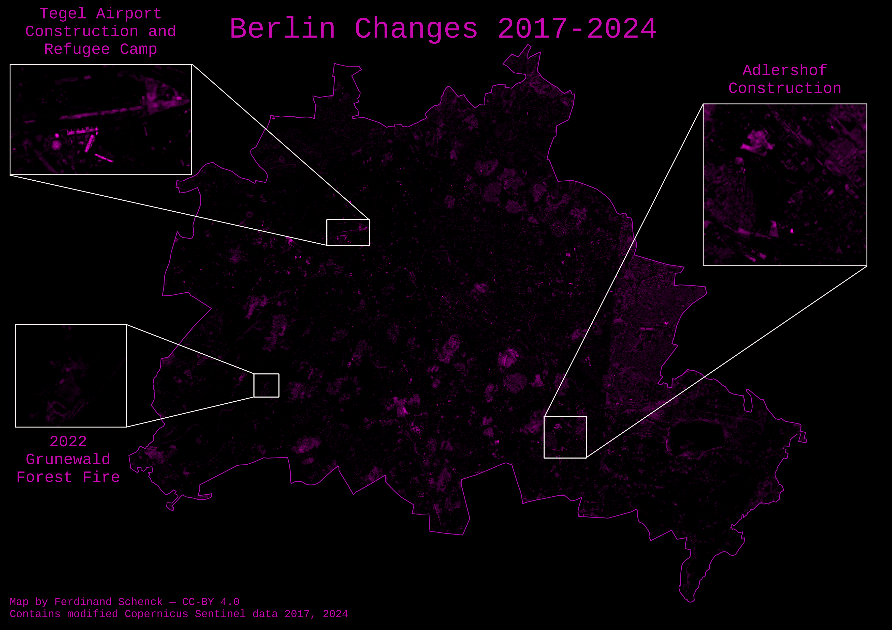


As you can see, it's a lot less clear. The Tegel change is picked up pretty well this way, but the Aldershof and especially Grunewald changes are not really all that clear. In addition, you might notice some large oval splotches on this change map. 

You might be thinking: Wow! That's a large change! I can't believe the embeddings missed this! Embeddings must be terrible!

Well:


::: {layout="[1,1,1]"}
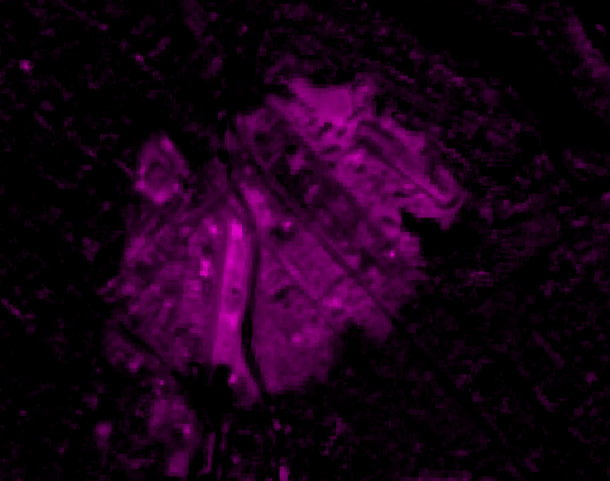

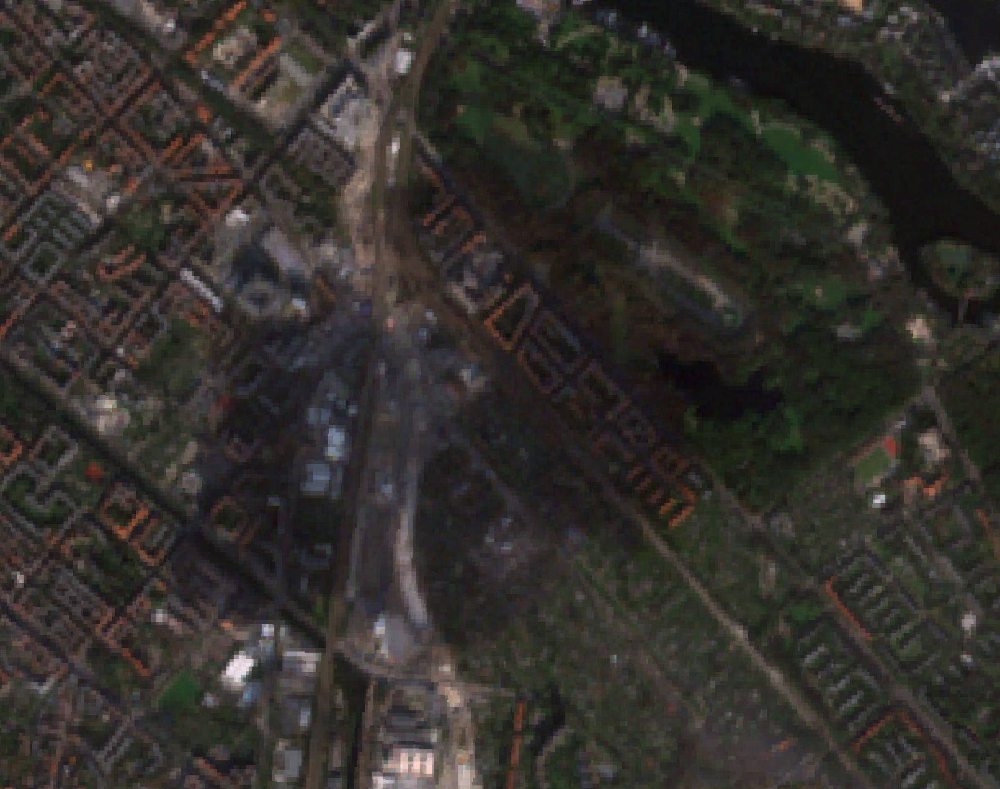

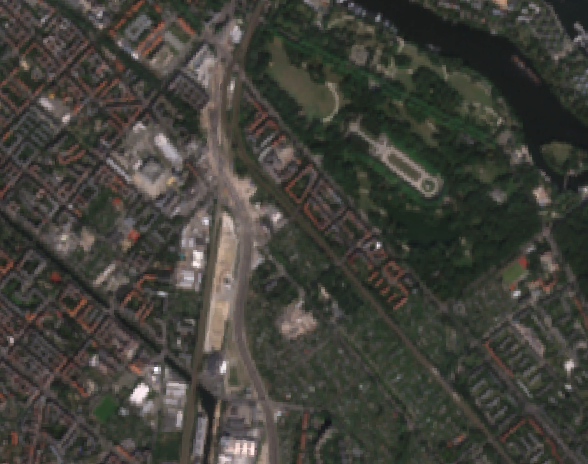
:::

Looking at the 2017 Sentinel-2 image, you can see a cloud shadow over the Treptow region of Berlin. Optically, this is quite a significant change, but semantically, it is meaningless. You can probably get around this by smarter filtering, and finding some way to exclude cloud shadows, but this is a pretty hard. 


### Conclusions

Geospatial embeddings are still relatively new, and people are still figuring out how to use them and what to use them for. 

What is clear to me is that they offer a great way to do large scale analyses very quickly. I scaled up the example above to a 800 km$^2$ area of the Amazon, and the runtime was still only 10 or so seconds on GEE. 

You could probably do a better job for your specific task by training a bespoke model, but that will likely take days of work, not to mention ML know-how, and a lot of compute. With embeddings, anyone can perform an analysis in minutes or hours, and the fact that this can easily be applied at a global scale is really impressive. I think we will see a lot more use cases built on geospatial embeddings in the coming years. I am sure that 


