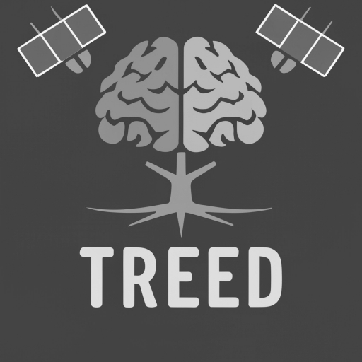
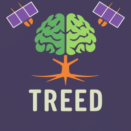

The day has finally arrived. Well actually, the day arrived in February, but who's counting. The Mojo language has finally publicly released the ability to do GPU programming - if you have a reasonably modern NVIDIA GPU. Luckily for me, I have an RTX 3090, and although it isn't [officially supported](https://docs.modular.com/max/faq#gpu-requirements), it is basically an A10, which is. Looking at some of the comments on the nightly releases, it does seem that AMD support is on the way as well. 

The Modular team publicly released the ability to do GPU programming in Mojo in release 25.1, with further support and documentation in release 25.2. Fun fact: release 25.2 also saw my first (tiny) contribution to the Mojo standard library.

This is a really important step for Mojo, a language that bills itself as a language designed to solve a variety of AI development challenges, which in this day and age basically means programming an increasingly heterogeneous stack of hardware. Today this mostly means GPUs, but there is an explosion of new accelerators like the ones from Cerebras, Groq and SambaNova, not to mention the not-so-new TPU from Google. 

As DeepSeek showed the world recently: if you're willing to put the work in, there is a lot more to be squeezed out of current-gen hardware than most people thought. Now, I don't think every ML engineer or researcher should be looking for every possible way to get more out of their compute, but there are definitely some wins to be had. As an example, I'm really fascinated by the work of Tri Dao and his collaborators, who work on deeply hardware aware improvements in machine learning, e.g. [FlashAttention](https://arxiv.org/pdf/2205.14135), which is mathematically equivalent to the attention mechanism that powers all transformer models, but with hardware aware optimizations that take into account the cost of memory access in GPUs. This does make me wonder what other optimizations are out there to be discovered. This however is not easy, as the authors note in the "Limitations and Future Directions" section of the FlashAttention paper:

> Our current approach to building IO-aware implementations of attention requires
writing a new CUDA kernel for each new attention implementation. This requires writing the attention
algorithm in a considerably lower-level language than PyTorch, and requires significant engineering effort.
Implementations may also not be transferrable across GPU architectures. These limitations suggest the
need for a method that supports writing attention algorithms in a high-level language (e.g., PyTorch), and
compiling to IO-aware implementations in CUDA


What makes GPU programming in Mojo interesting is that you don't need the CUDA toolkit to do so, and compiles down to [PTX](https://developer.nvidia.com/blog/understanding-ptx-the-assembly-language-of-cuda-gpu-computing/) which you can think of as NVIDIA's version of assembly. If Mojo (and Max in general) can make it easier to write GPU kernels in a more user-friendly language, it could be a game changer.

If you want to get started, there is a guide for [getting started with GPU programming in Mojo](https://docs.modular.com/stable/mojo/manual/gpu/intro-tutorial/) from Modular (the company behind Mojo), which I strongly recommend.

## A little example

I learn by doing, so I wanted to try to implement something with relatively simple using the GPU. 

The example idea I chose is to transform an RGB image to grayscale, which is an embarrassingly parallel problem without a lot of complexity. 
I was halfway through writing this post before I realized that there was already an [example](https://github.com/modular/max/blob/main/examples/gpu_functions/grayscale.mojo) of how to do grayscale conversion in the Mojo repo, but oh well. I basically just start with what's in the documentation, but I added another example that I did do myself. 


To start, let's read in an image using [mimage](https://github.com/fnands/mimage), an image processing library I am working on.

Let's take a look at our input image:

<div style="text-align: center;">
    
</div>

```mojo
import mimage

original_image = mimage.imread("treed_brain_512.png")
print(original_image.spec())
```

```text
512x512x4xuint8
```

The image is represented here as a rank three tensor with the dimensions being width, height and channels, and the data type is an unsigned 8-bit integer. In this case we have four channels: red, green, blue and alpha (transparency), the latter being 255 for all pixels.

```mojo
print(original_image[0], original_image[1], original_image[2], original_image[3])
```

```text
73 63 97 255
```

So what we want to do here is to sum together the RGB values for each pixel, using the weights `0.299`, `0.587` and `0.114` for red, green and blue respectively. If you want to know why we are using these weights, read this [article](https://e2eml.school/convert_rgb_to_grayscale). 

The first thing we need to do is convert the tensor to `float32` to prevent any overflow. I'm throwing away the alpha channel for simplicity:

```{mojo}
#| eval: false
#|code-fold: true
#|code-summary: imports

from max.driver import accelerator, cpu, Tensor, Accelerator
from sys import exit, has_accelerator
from max.tensor import TensorSpec
from max.tensor import Tensor as MaxTensor
from utils.index import Index
from layout import LayoutTensor, Layout
from gpu.id import block_dim, block_idx, thread_idx
from gpu.host import DeviceContext, Dim
from math import isclose
```

```mojo

height = original_image.shape()[0]
width =  original_image.shape()[1]
channels = 3

float32_spec = TensorSpec(DType.float32, height, width,  channels)
float32_image = MaxTensor[DType.float32](float32_spec)

for y in range(height):
    for x in range(width):
        for c in range(channels):
            float32_image[Index(y, x, c)] = original_image[Index(y, x, c)].cast[DType.float32]()
            
print(float32_image.spec())
```

```text
512x512x3xfloat32
```

### To Grayscale on the CPU

Now that we have that, let's define a simple version of the transform we want on CPU.

```mojo
fn to_grayscale_simple(input_image: MaxTensor[DType.float32]) -> MaxTensor[DType.float32]:
    var height = input_image.shape()[0]
    var width =  input_image.shape()[1]
    
    var grayscale_spec = TensorSpec(DType.float32, height, width)
    var grayscale_image = MaxTensor[DType.float32](grayscale_spec)

    for y in range(height):
        for x in range(width):
            grayscale_image[Index(y, x)] = 0.299 * input_image[Index(y, x, 0)] + 0.587*input_image[Index(y, x, 1)] + 0.114*input_image[Index(y, x, 2)] 

    return grayscale_image

grayscale_simple = to_grayscale_simple(float32_image)
print(grayscale_simple.spec())
```

```text
512x512xfloat32
```

```{mojo}
#| eval: false
#|code-fold: true
#|code-summary: numpy conversion

from python import Python, PythonObject
from memory import memcpy, UnsafePointer

# Stolen and lightly adapted from https://github.com/basalt-org/basalt/blob/main/basalt/utils/tensor_creation_utils.mojo
fn to_numpy(tensor: MaxTensor[DType.float32]) -> PythonObject:
    try:
        var np = Python.import_module("numpy")

        np.set_printoptions(4)

        var rank = tensor.rank()
        var dims = PythonObject([])
        for i in range(rank):
            dims.append(tensor.dim(i))
        var pyarray: PythonObject = np.empty(dims, dtype=np.float32)

        var pointer_d = pyarray.__array_interface__["data"][0].unsafe_get_as_pointer[DType.float32]()
        var d: UnsafePointer[Float32] = tensor.unsafe_ptr().bitcast[Float32]()
        memcpy(pointer_d, d, tensor.num_elements())

        _ = tensor

        return pyarray^
    except e:
        print("Error in to numpy", e)
        return PythonObject()


```

So hopefully that worked! Let's see if it's correct.

I haven't implemented image saving in mimage yet, so let's use the good old Python PIL library to save the image.

```mojo
numpy_grayscale_simple = to_numpy(grayscale_simple)
var pil_image = Python.import_module("PIL.Image")
var np = Python.import_module("numpy")
grayscale_py_image = pil_image.fromarray(numpy_grayscale_simple.astype(np.uint8))
grayscale_py_image.save("treed_brain_512_grayscale_simple.png")

```

As you can see, we've now translated the image to grayscale!
<div style="text-align: center;">
  
</div>

### To Grayscale on the GPU

Now that we have a working CPU implementation, let's try to implement the same function on the GPU.

But first, let's check if Mojo can actually find my GPU:

```mojo

if not has_accelerator():
    print("A GPU is required to run this program")
    exit()

host_device = cpu()
print("Found the CPU device")
gpu_device = accelerator()
print("Found the GPU device")
```
```text
Found the CPU device
Found the GPU device
```
Now that we know that Mojo can find our GPU, let's define the function that will do the actual conversion. This kernel reads a pixel from the input tensor, converts it to grayscale and writes the result to the output tensor. It is parallelized across the output tensor, which means that each thread is responsible for one pixel in the output tensor.

As you can see, it takes in as parameters the layout specifications of the input and output tensors, the width and height of the image, and the input and output tensors themselves.

```mojo
fn color_to_grayscale_conversion[
    image_layout: Layout,
    out_layout: Layout,
](
    width: Int,
    height: Int,
    image: LayoutTensor[DType.float32, image_layout, MutableAnyOrigin],
    out: LayoutTensor[DType.float32, out_layout, MutableAnyOrigin],
):
    """Converting each RGB pixel to grayscale, parallelized across the output tensor on the GPU.
    """
    row = block_dim.y * block_idx.y + thread_idx.y
    col = block_dim.x * block_idx.x + thread_idx.x


    if col < width and row < height:
        red = image[row, col, 0]
        green = image[row, col, 1]
        blue = image[row, col, 2]
        out[row, col]  = 0.299 * red + 0.587 * green + 0.114 * blue

```

Now, the first slightly awkward thing I had to do was convert the image from a `max.tensor.Tensor`, which is what is returned by `mimage.imread`, to a `max.driver.Tensor`, which is the new tensor type that is compatible with GPU programming. I am assuming that `max.tensor.Tensor` will be deprecated in the future. 

With this new tensor type you can explicitly set which device the tensor should be allocated on. In this case I will allocate it to the CPU, i.e. the host device, and then copy over the data from the old tensor to the new one.

```mojo
rgb_tensor = Tensor[DType.float32, 3](
        (height, width, channels), host_device
    )

for y in range(height):
    for x in range(width):
        for c in range(channels):
            rgb_tensor[y, x, c] = float32_image[Index(y, x, c)]


```

Next, we have to move the tensor to the GPU.

```mojo
rgb_tensor = rgb_tensor.move_to(gpu_device)
```

Now that was easy enough. The next step is to allocate the output grayscale tensor. As we don't need to copy over the data from the old tensor, we can just allocate it on the GPU immediately.

```mojo
# Allocate a tensor on the accelerator to host the grayscale image.
gray_tensor = Tensor[DType.float32, 2](
    (height, width), gpu_device
)

```

Next, we get the layout tensors for the input and output tensors. The documentation on LayoutTensor is a bit sparse, but it seems to be there to make it easy to reason about memory layouts.

```mojo
rgb_layout_tensor = rgb_tensor.to_layout_tensor()
gray_layout_tensor = gray_tensor.to_layout_tensor()

```

There seems to be two ways to use GPU functions in Mojo. The first is to use the `Accelerator.compile` function, which is what I do here. This compiles the gpu kernel into a function which can be called as normal. While this function is being executed on the GPU, the host device will wait until it is finished before moving on. Later in this post I will show the other option which allows the host device to do other things while waiting for the GPU.

```mojo
gpu_function = Accelerator.compile[
    color_to_grayscale_conversion[
        rgb_layout_tensor.layout, gray_layout_tensor.layout
    ]
](gpu_device)
```

And that's it! Let's call the GPU function. Here I will device the image up into blocks of 32x32 pixels, and then call the function. I have to admit, I have no clue what the best practices are for choosing the block size, so if you know a good rule of thumb, please let me know. I wonder if there is a way to tune these parameters at compile time? 

```mojo
gpu_function(
    gpu_device,
    width,
    height,
    rgb_layout_tensor,
    gray_layout_tensor,
    grid_dim=Dim(512 // 32, 512 // 32),
    block_dim=Dim(32, 32),
)


```

Once that is run, we move the grayscale tensor back to the CPU and compare the results.

```mojo
gray_tensor = gray_tensor.move_to(host_device)

all_match = True

for y in range(height):
    for x in range(width):
        # Get values from both tensors
        simple_value = grayscale_simple[Index(y, x)]
        gpu_value = gray_tensor[y, x, 0]
        
        # Use isclose to compare values
        if not isclose(simple_value, gpu_value):
            all_match = False


if all_match:
    print("✅ Verification passed: CPU and GPU results match within numerical precision")
else:
    print("❌ Verification failed: CPU and GPU results differ significantly")
```

```text
✅ Verification passed: CPU and GPU results match within numerical precision
```

and there we have it! We have successfully converted an image to grayscale using the GPU. 


## Another example: downsampling an image

Another example I wanted to try is downsampling an image. This is a bit more complex than the grayscale conversion, because we need to handle the different dimensions of the input and output tensors.

First let's define some test images to make sure the function is doing what we expect. 

This is a 16x16 image with 1 channel, where each 2x2 block has a unique value.

```mojo
#| code-fold: true

# Some helper functions to print out the "image"

def print_image[h: Int, w: Int](t: MaxTensor[DType.float32]):
    """A helper function to print out the grayscale channel intensities."""
    for row in range(h):
        for col in range(w):
            var v = t[Index(row, col)].cast[DType.uint8]()
            if v < 100:
                print(" ", end="")
                if v < 10:
                    print(" ", end="")
            print(v, " ", end="")
        print("")


def print_image[h: Int, w: Int](mut t: Tensor[DType.float32, 3]):
    """A helper function to print out the grayscale channel intensities."""
    for row in range(h):
        for col in range(w):
            var v = t[row, col, 0].cast[DType.uint8]()
            if v < 100:
                print(" ", end="")
                if v < 10:
                    print(" ", end="")
            print(v, " ", end="")
        print("")
```

```mojo
    test_image_1_channel_2x = MaxTensor[DType.float32](
        TensorSpec(DType.float32, 16, 16, 1),
    )

    test_image_1_channel_2x_gpu = Tensor[DType.float32, 3](
        (16, 16, 1), host_device
    )
    

    for y in range(16):
        for x in range(16):
            # Create a pattern of 2x2 blocks where each block has the same value
            # The value increases for each block (0, 1, 2, etc.)
            var block_y: UInt8 = y // 2
            var block_x: UInt8 = x // 2

            test_image_1_channel_2x[Index(y, x)] =   (block_x + 8 * block_y).cast[DType.float32]()
            test_image_1_channel_2x_gpu[y, x, 0] = (block_x + 8 * block_y).cast[DType.float32]()

    print_image[16, 16](test_image_1_channel_2x)

```

```text
  0    0    1    1    2    2    3    3    4    4    5    5    6    6    7    7  
  0    0    1    1    2    2    3    3    4    4    5    5    6    6    7    7  
  8    8    9    9   10   10   11   11   12   12   13   13   14   14   15   15  
  8    8    9    9   10   10   11   11   12   12   13   13   14   14   15   15  
 16   16   17   17   18   18   19   19   20   20   21   21   22   22   23   23  
 16   16   17   17   18   18   19   19   20   20   21   21   22   22   23   23  
 24   24   25   25   26   26   27   27   28   28   29   29   30   30   31   31  
 24   24   25   25   26   26   27   27   28   28   29   29   30   30   31   31  
 32   32   33   33   34   34   35   35   36   36   37   37   38   38   39   39  
 32   32   33   33   34   34   35   35   36   36   37   37   38   38   39   39  
 40   40   41   41   42   42   43   43   44   44   45   45   46   46   47   47  
 40   40   41   41   42   42   43   43   44   44   45   45   46   46   47   47  
 48   48   49   49   50   50   51   51   52   52   53   53   54   54   55   55  
 48   48   49   49   50   50   51   51   52   52   53   53   54   54   55   55  
 56   56   57   57   58   58   59   59   60   60   61   61   62   62   63   63  
 56   56   57   57   58   58   59   59   60   60   61   61   62   62   63   63  
```

If this works we should have a downsampled 8x8 image with the same values as the original image. 


### Downsampling on the CPU

Let's start with a CPU implementation:

```mojo
fn downsample_cpu[factor: Int](input_image: MaxTensor[DType.float32]) -> MaxTensor[DType.float32]:
    var height = input_image.shape()[0]
    var width =  input_image.shape()[1]
    var channels = input_image.shape()[2]

    var downsampled_height = height // factor   
    var downsampled_width = width // factor
    
    var downsampled_spec = TensorSpec(DType.float32, downsampled_height, downsampled_width, channels)
    var downsampled_image = MaxTensor[DType.float32](downsampled_spec)

    for y in range(downsampled_height):
        for x in range(downsampled_width):
            for c in range(channels):
                var sum: Float32 = 0.0
                for f1 in range(factor):
                    for f2 in range(factor):
                        sum += input_image[Index(y * factor + f1, x * factor + f2, c)]

                downsampled_image[Index(y, x, c)] = sum/(factor * factor)

    return downsampled_image

downsample_test_image_1_channel_2x = downsample_cpu[2](test_image_1_channel_2x)

print_image[8, 8](downsample_test_image_1_channel_2x)


```

```text
  0    1    2    3    4    5    6    7  
  8    9   10   11   12   13   14   15  
 16   17   18   19   20   21   22   23  
 24   25   26   27   28   29   30   31  
 32   33   34   35   36   37   38   39  
 40   41   42   43   44   45   46   47  
 48   49   50   51   52   53   54   55  
 56   57   58   59   60   61   62   63  
```

So it works! 
This does make some assumptions about the input image, like that it is a multiple of the factor. But good enough for a blog post. 

Now let's try to do the same on the GPU. 


### Downsampling on the GPU

```mojo
fn downsample_gpu[
    factor: Int,
    image_layout: Layout,
    out_layout: Layout,
](
    width: Int,
    height: Int,
    channels: Int,
    image: LayoutTensor[DType.float32, image_layout, MutableAnyOrigin],
    out: LayoutTensor[DType.float32, out_layout, MutableAnyOrigin],
):
    
    row = block_dim.y * block_idx.y + thread_idx.y
    col = block_dim.x * block_idx.x + thread_idx.x
    channel = block_dim.z * block_idx.z + thread_idx.z

    

    if col < width and row < height and channel < channels:
        out[row, col, channel] = 0.0
        for f1  in range(factor):
            for f2 in range(factor):
                out[row, col, channel] += image[row * factor + f1, col * factor + f2, channel]

 

        out[row, col, channel] /= (factor * factor)
```

We again define our output tensor on the GPU, get the layout tensor and move the data from the host device to the GPU.

```mojo

downsample_test_image_1_channel_2x_gpu = Tensor[DType.float32, 3](
    (8, 8, 1), gpu_device
)

test_image_1_channel_2x_gpu_layout = test_image_1_channel_2x_gpu.to_layout_tensor()
downsample_test_image_1_channel_2x_gpu_layout = downsample_test_image_1_channel_2x_gpu.to_layout_tensor()

test_image_1_channel_2x_gpu = test_image_1_channel_2x_gpu.move_to(gpu_device)
```

This time we will try the other way of using GPU functions: enqueing the function(s) to be executed on the GPU. 

This means the host device will not wait for the GPU to finish the function, but can do other things while the GPU is running. When we call `synchronize` the host device will wait for the GPU to finish all enqueued functions. 

This allows for some interesting things, like running the GPU function in parallel with some other code on the host device. This is can also be a little bit dangerous if you try to access the GPU memory from the host device while the GPU is still running. 

Let's try it out:

```mojo
var ctx = DeviceContext()


ctx.enqueue_function[downsample_gpu[
    2,
    test_image_1_channel_2x_gpu_layout.layout,
    downsample_test_image_1_channel_2x_gpu_layout.layout
]](
    8, 8, 1, test_image_1_channel_2x_gpu, downsample_test_image_1_channel_2x_gpu, grid_dim=Dim(8, 8), block_dim=Dim(1, 1))

ctx.synchronize()

print_image[8, 8](downsample_test_image_1_channel_2x_gpu)


```

```text
  0    1    2    3    4    5    6    7  
  8    9   10   11   12   13   14   15  
 16   17   18   19   20   21   22   23  
 24   25   26   27   28   29   30   31  
 32   33   34   35   36   37   38   39  
 40   41   42   43   44   45   46   47  
 48   49   50   51   52   53   54   55  
 56   57   58   59   60   61   62   63  
```

Again, it works! 


Let's try it on our original image, and downsample it by a factor of 2 and 4. Let's also do a CPU version for comparison, and define the output tensors on the GPU.

```mojo
# CPU version for comparison
downsampled_image_2x = downsample_cpu[2](float32_image)
downsampled_image_4x = downsample_cpu[4](float32_image)


# Allocate tensors on the accelerator to host the downsampled images.
downsampled_2x_tensor_gpu = Tensor[DType.float32, 3](
    (height // 2, width // 2, channels), gpu_device
)

downsampled_4x_tensor_gpu = Tensor[DType.float32, 3](
    (height // 4, width // 4, channels), gpu_device
)

downsampled_2x_layout_tensor = downsampled_2x_tensor_gpu.to_layout_tensor()
downsampled_4x_layout_tensor = downsampled_4x_tensor_gpu.to_layout_tensor()

```

Now we can call the GPU function. 

Notice how we can enqueue a second function while the first one is still running. 
As it does not depend on the first function to finish, it can potentially start running before the first function has finished.

```mojo
ctx.enqueue_function[downsample_gpu[
    2,
    rgb_layout_tensor.layout,
    downsampled_2x_layout_tensor.layout
]](
    width // 2, height // 2, channels, rgb_layout_tensor, downsampled_2x_layout_tensor, grid_dim=Dim(512 // 2, 512 // 2), block_dim=Dim(1, 1, 3))


ctx.enqueue_function[downsample_gpu[
    4,
    rgb_layout_tensor.layout,
    downsampled_4x_layout_tensor.layout
]](
    width // 4, height // 4, channels, rgb_layout_tensor, downsampled_4x_layout_tensor, grid_dim=Dim(512 // 4, 512 // 4), block_dim=Dim(1, 1, 3))

ctx.synchronize()


downsampled_2x_tensor_gpu = downsampled_2x_tensor_gpu.move_to(host_device)
downsampled_4x_tensor_gpu = downsampled_4x_tensor_gpu.move_to(host_device)
```

Now let's verify the results:

```mojo
all_match_2x = True

for y in range(height // 2):
    for x in range(width // 2):
        for c in range(channels):
            # Get values from both tensors
            cpu_downsampled_value = downsampled_image_2x[Index(y, x, c)].cast[DType.float32]()
            gpu_downsampled_value = downsampled_2x_tensor_gpu[y, x, c]
            
            # Use isclose to compare values
            if not isclose(cpu_downsampled_value, gpu_downsampled_value):
                all_match_2x = False
                print("Mismatch at position (", y, ", ", x, ", ", c, "): CPU=", cpu_downsampled_value, ", GPU=", gpu_downsampled_value)
                print("Difference: ", abs(cpu_downsampled_value - gpu_downsampled_value))

if all_match_2x:
    print("✅ Verification passed: CPU and GPU 2x downsampling results match within numerical precision")
else:
    print("❌ Verification failed: CPU and GPU 2x downsampling results differ significantly")


# Verify 4x downsampling results
print("\nVerifying 4x downsampling results...")
all_match_4x = True

for y in range(height // 4):
    for x in range(width // 4):
        for c in range(channels):
            # Get values from both tensors
            cpu_downsampled_value = downsampled_image_4x[Index(y, x, c)].cast[DType.float32]()
            gpu_downsampled_value = downsampled_4x_tensor_gpu[y, x, c]
            
            # Use isclose to compare values
            if not isclose(cpu_downsampled_value, gpu_downsampled_value):
                all_match_4x = False
                print("Mismatch at position (", y, ", ", x, ", ", c, "): CPU=", cpu_downsampled_value, ", GPU=", gpu_downsampled_value)
                print("Difference: ", abs(cpu_downsampled_value - gpu_downsampled_value))

if all_match_4x:
    print("✅ Verification passed: CPU and GPU 4x downsampling results match within numerical precision")
else:
    print("❌ Verification failed: CPU and GPU 4x downsampling results differ significantly")
```

```text
✅ Verification passed: CPU and GPU 2x downsampling results match within numerical precision
✅ Verification passed: CPU and GPU 4x downsampling results match within numerical precision
```

Great! We can save these and see what they look like:

```mojo
downsampled_image_2x = downsample_cpu[2](float32_image)
numpy_downsampled_image_2x = to_numpy(downsampled_image_2x)

downsampled_image_4x = downsample_cpu[4](float32_image)
numpy_downsampled_image_4x = to_numpy(downsampled_image_4x)


downsampled_2x_py_image = pil_image.fromarray(numpy_downsampled_image_2x.astype(np.uint8))
downsampled_2x_py_image.save("treed_brain_512_downsampled_2x.png")

downsampled_4x_py_image = pil_image.fromarray(numpy_downsampled_image_4x.astype(np.uint8))
downsampled_4x_py_image.save("treed_brain_512_downsampled_4x.png")

```

And as we can see, the images get progressively more blurry the more we downsample.

<div style="text-align: center;">
  
  
  
</div>

## Conclusion


This was my first quick look at GPU programming in Mojo. I feel the hardest thing is conceptually understanding how to properly divide the work between threads, and how to assign the correct numbers of threads, blocks and warps (which I didn't even get into here). I guess the next move is to look up some guide on how to *efficiently* program GPUs, and to maybe try some more substantial examples. 


The documentation on GPU programming in Mojo is still a bit sparse, and there aren't many examples out there in the wild to learn from, but I am sure that will change soon. The Moduar team did say they are releasing it unpolished so that they can gather some community feedback early. 

For someone who uses GPUs a lot in my day job, I never really interact with the GPUs at a low level; it's always through PyTorch or JAX or some other layer of abstraction from Python. It's quite fun to have such low level access to the hardware in a language that doesn't feel that dissimilar from Python. 

I think this is really where I am starting to see the vision behind Mojo more clearly. I think the shallow take is that Mojo is a faster Python, or basically some ungodly hybrid between Python and Rust, but the more I play with it the more I feel it's a language designed to make programming heterogenous hardware easier. I don't think it will be the only language like this we'll see, and I am curious to see if other languages based on MLIR will pop up soon, or if some existing languages will adapt. Maybe basing Julia 2.0 off MLIR instead of LLVM is a good next move for the language. 

You only need to look at the schematic off Apple silicon chips these days to see which way the wind is blowing: a significant fraction of the chip is dedicated to GPU cores. I think the days where having a GPU attached to your computer was only for specialists is going out the window, and we might pretty soon be able to safely assume that every modern computer will have at least a decent amount of GPU cores available for general purpose tasks, and not just graphics. Still, I doubt most programmers will ever have to worry about actually directly programming GPUs, but I am interested to see how libraries take advantage of this fact. 

