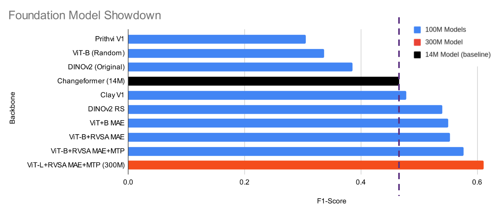

Geospatial foundation models (GFMs) have been on my mind recently, partially because I attended the [ESA-NASA International Workshop on AI Foundation Model for EO](https://nikal.eventsair.com/cmspreview/nasa-esa-international-workshop-on-geospatial-ai-foundation-model-for-earth-observation-and-earth-sciences/) and partially because I've been working on fine tuning some GFMs for downstream use at work for the last while. This post was in part prompted by two recent LinkedIn posts, one by [Christopher Ren](https://www.linkedin.com/posts/christopherren_geospatial-foundation-models-gfms-are-under-trained-activity-7330823160797257728-o5El) and the other by [Madeline Lisaius](https://www.linkedin.com/posts/activity-7332750506114588674-YaMA), both of which express some amount of skepticism about the way in which current GFMs are trained, although from somewhat different angles. Christopher Ren also wrote an expanded [blog post](https://christopherren.substack.com/p/geospatial-foundational-disappointments) on the subject, which takes aim mostly at [IBMs new TerraMind](https://arxiv.org/pdf/2504.11171) GFM, but it is worth reading the responses from one of the TerraMind authors at the bottom of the post as that adds some nuance to the arguments.

It's somewhat clear that GFMs are a hot topic in the Earth Observation (EO) space at the moment, and it is fair to question whether the hype is warranted. At the ESA-NASA workshop one of the points made was that there seems to be much more activity in the creation of GFMs than actual downstream use of them so far, and there were some interesting discussions as to why this might be the case at the moment.   

A recent [post](https://www.linkedin.com/pulse/from-earth-pixels-geoembeddings-bruno-sanchez-andrade-nu%C3%B1o-h0sbf/) from Bruno Sanchez-Andrade Nuño (director of the Clay project) also made me think that there is a rough bifurcation in the GFM space appearing: one branch goes deep and the other goes wide. I think it is best if we understand which branch a model fits into and not judge one by the standards of the others. 

I'm not going to directly respond to the other conversations going on: I'm just adding my two cents to the mix, and I want to be clear that the work I am doing definitely falls into the "go deep" branch, and my opinions are very much coloured by that fact.  

## Should GFMs go more general or specialize?

On the surface this might seem like a slightly odd question seeing as one of the principle reasons people are interested in GFMs (and FMs in general) is better generalization: EO is after all often a global endeavour, and it is desirable to have a foundation model that will help your downstream tasks generalize across geographies, illumination conditions, imaging angles etc. But there are many aspects to generalization, some of which don't apply to all sensors. An example is the time of day an image was taken at. This can strongly affect what your image looks like, as shadows and illumination levels can vary greatly by time of day. This however does not really affect missions like Sentinel-2, where the orbit has been selected in such a way that the mean local solar time when the image is taken is always approximately 10:30 am, leading (by design) to very consistent illumination levels. Similar arguments go for viewing angles. 

One of the ways that people have been trying to get more general is to train foundation models on multiple sources. Examples of this are the Clay foundation model (at least V1) which was trained on a wide range of sensors from MODIS, with a 500 m GSD, to aerial imagery of New Zealand at under 50 cm GSD: 

| Platform | Spatial Coverage | Spectral bands | GSD (meters) | Samples |
|----------|-----------------|----------------|--------------|---------|
| Landsat 8 and 9 | Global | 6 optical bands | 30 | 11,617,984 |
| Sentinel 2 L2A | Global | 10 optical bands | 10 | 18,683,945 |
| Sentinel 1 RTC | Global | 2 radar bands | 10 | 16,133,394 |
| NAIP | USA | 4 optical bands | < 1 | 20,984,171 |
| LINZ | New Zealand | 3 optical bands | < 0.5 | 3,299,006 |
| MODIS | Global | 7 bands | 500 | 1,350,864 |

Another example of this is DOFA, which takes a similar approach to variety in input sensors, this time including hyperspectral data at 224 spectral bands: 

| Platform | Spatial Coverage | Spectral bands | GSD (meters) | Samples |
|----------|-----------------|----------------|--------------|---------|
| Sentinel-1 | Global | 2 SAR bands (VV, VH) | 5 x 20 | 4,642,353 |
| Sentinel-2 | Global | 9 optical bands (0.49-2.15µm) | 10 | 977,774 |
| Gaofen | China (cities) | 4 bands (RGB + NIR) | 4 | 117,450 |
| NAIP | USA | 3 bands (RGB) | 1 | 2,332,351 |
| EnMAP | Various | 224 hyperspectral bands | 30 | 11,483 |

The [DOFA paper](https://arxiv.org/abs/2403.15356) is worth a read, and putting on my scientist hat: this is really interesting work, and it's really interesting to see the different solutions that these authors have come up with to make a single model deal with such varied inputs. But putting back on my engineer hat I have to ask: what do we gain from this? 

## The engineering perspective

One of the points made in the DOFA paper:   

> The increasing number of specialized foundation models makes it difficult to select the most appropriate one for a specific downstream task.

On the surface this sounds fair, but is it really that hard to go to [PapersWithCode](https://paperswithcode.com/), find the most similar dataset to your downstream task and select a model based on that? I can't really think of a scenario where you would not just spend a day or two searching through the literature for the most fitting model for your particular use case. The one case I can maybe think this might be the case is if you are a geospatial person with no ML skills and have a model that was set up for you as a black box behind some interface and squeezing every last bit of performance out is not critical to you. 

When implementing a model for a specific product need, one often focuses on the specific sensor, or at least a set of very similar sensors, e.g. sub-meter GSD sensors with at least the four usual spectral bands. When building a product that will utilize exclusively Sentinel-1 data, does the model really gain anything from being trained on Sentinel-2 and aerial imagery as well? 

With all that being said, if you do have multiple sensors available at inference time (e.g. Sentinel-2 and Sentinel-1 data), it does seem to make sense to train/infer on multiple modalities at once. See e.g. [table 2 in the TerraMind paper](https://arxiv.org/pdf/2504.11171v1). 

## A concrete example

A while ago we were testing out a few foundation models as backbones for a product we are developing, which boils down to bi-temporal change detection using Planet's SkySat constellation. We chose the main backbone we are using based on benchmarks, but I did have the nagging question of how much do we really gain from this, and if other backbones might offer better performance? This was basically the theme of [my talk](https://fnands.com/talks/#using-foundation-models-for-very-high-resolution-bi-temporal-change-detection.) at the aforementioned ESA-NASA workshop. 

I ran a few test using a variety of FM backbones, some trained on remote sensing data, and some just on natural images, just to see how much the pre-training dataset really matters. To make the comparison fair, the backbones used all had around 100 M parameters, but I did throw in a smaller baseline ([ChangeFormer](https://ieeexplore.ieee.org/document/9883686)), as well as a 300 M version of the best performing network just to see if size matters (spoiler: it does). 

One of the most interesting comparisons here is DINOv2: I used two variations, one using the original weights trained on natural images from Meta, and another with weights from [Keumgang Cha](https://github.com/chagmgang/dinov2-remote-sensing), which were trained on the [MillionAID](https://arxiv.org/pdf/2006.12485) and [SkyScript](https://arxiv.org/pdf/2312.12856) datasets. MillionAID is exclusively aerial imagery, while SkyScript contains mostly aerial imagery, plus some SkySat, Sentinel-2 and Landsat images. It's abundantly clear that the same architecture trained on remote sensing images greatly improve downstream performance compared to a the variant that was trained on natural images. This is expected, but it's impressive to see how large this gap is. 

The best model we tested was trained mostly on aerial imagery, showing the domain gap isn't so much whether or not your sensor is in space or on a plane, but has more to do with similar resolutions.  

The models were all trained for the same number of epochs, on the same relatively small dataset (around 1600 patches of 512 x 512 pixels) with the same optimizer etc. The encoders were not frozen, but trained with a lower learning rate than the decoders, as is common practice in most transfer learning scenarios. I will caveat this all with saying that I didn't do a massive amount of hyperparameter tuning for this test, but I think the differences are significant enough that it probably wouldn't make too much of a difference.

 

## How can we test this?

What I would need to see to be convinced is that when training a foundation model on multiple sensors that it would perform better on downstream tasks on each of the sensors than it would be if it was trained exclusively on the specific sensor to be used. I.e. one would need to show that the model would be more than the sum of it's parts. 

The question is pretty much, given the same architecture, compute budget and dataset size, can a model learn something from one sensor that improves its performance on another? 

I'm definitely not ruling out the possibility that there might be some case (e.g. the sensor you are targeting doesn't have a lot of data available), but I have the feeling that the further away in GSD and spectral characteristics you go the less helpful pre-training becomes. 

## How specialized can we go? 

It's fairly obvious that the best GFM you can choose will likely be the one trained on the exact sensor you are targeting for your downstream task. This is fairly easy for sensors like the Sentinel missions or the Landsat missions, where anyone with a bit of compute to burn can easily download tons of data from those missions and train a model. Even for aerial imagery there is a lot of open data available, with the caveat that the data is not as global, and aerial sensors do have some sensor to sensor variability.   

Where this gets tricky is in the commercial domain, where data isn't freely available and providers put strict licenses on their data[^1]. To train a foundation model on commercial data requires you to dump somewhere between hundreds of thousands up to millions of Euros on data alone, which is infeasible for most researchers, and a significant investment for most companies. The only case that I know of so far of someone creating a sensor specific foundation model is a [Pleiades Neo foundation model created by Disaitek](https://www.disaitek.ai/pneo-foundation-model), which was made possible by being granted access to Pleiades Neo imagery through a "Call for Innovation" from Aribus and CNES. Disaitek of course does not make this model public, as this presumably gives them a bit of an edge over their competitors, and as the model was trained on data covering France only, it is questionable of how much use it would be in other parts of the world. 

So what can be done in the commercial space? Most companies don't have access to enough data to easily train a foundation model, and those who do are unlikely to share it as it gives them an edge over their competition. The only players with both the access to the data and the incentive to make these models available to others are the imagery providers themselves, i.e. Planet, Airbus, Maxar, Blacksky, Capella etc. 

Do I think these providers will just open these models for all to use? I doubt it, but they might offer it as a perk to their customers. I.e. something along the lines of "buy at least X Euro worth of imagery per year and get access to our FM". 

The competition in the 30 cm class imagery space seems to be heating up, with several players building up large constellations of satellites in this resolution range, like Maxar's Legion, Planet's Pelican and BlackSky's Gen-3. One way these providers can differentiate their offerings would be by offering a foundation model trained on their specific sensor. Whether I think it's likely that they do this is another question. 

[^1]: The one exception here is Umbra, who have a very generous [open data program](https://umbra.space/open-data/), and probably have enough data there that anyone can just train a decently sized model on their data. 

## Afterword

Please take this post for what it is: the opinionated rant of someone who works in a somewhat privileged niche of the EO domain where I have a lot of expensive VHR data to play with. The problems I am trying to solve and the constraints I have are likely quite different from those that others might encounter. 

With that being said, if you find yourself if a similar boat to me and are wondering which foundation model to pick for your particular task: pick the one trained on the closest thing you can find to the sensor you are targeting.  

I am kind of hoping that someone does prove me wrong, and I will happily write an apology post if some does so. 