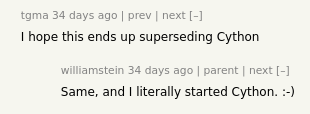
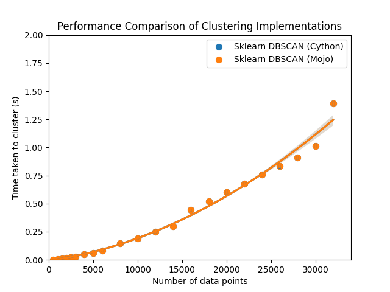

Ever since I heard about Mojo I (and presumably most other people) thought it would be a good language to speed up functions to be called from Python. Everyone knows that vanilla Python can be slow, but one of the reasons that Python programs can be reasonably fast in practice is because Python often leans on libraries written in more performant languages, predominantly C/C++, but increasingly also Rust.

Until recently, there has been no real way to call Mojo code from Python, but about a month ago (in Max [release 25.4](https://docs.modular.com/mojo/manual/python/mojo-from-python)) the ability to [call Mojo from Python](https://docs.modular.com/mojo/manual/python/mojo-from-python) was added as a beta feature. It's not fully yet, and it will likely still change a lot, but I wanted to give it a look just to get an idea for where things are heading. 


One idea that I had when I heard about Mojo was that Mojo might be a good replacement for Cython and apparently I was not the only one to have had this thought:





The comments are from the [HackerNews discussion](https://news.ycombinator.com/item?id=44331316) on Vincent Warmerdam's blog post titled ["Python can run Mojo now"](https://koaning.io/posts/giving-mojo-a-spin/) which made it to the front page of HN a while ago. 


So where can I find a lot of Cython code? 

## Scikit-learn

Scikit-learn implements a bunch of machine learning algorithms and related utilities, and makes heavy use of Cython. How hard would it be to translate some of the Cython code in scikit-learn to Mojo?

I wanted a piece of code that was relatively simple, both just as I didn't want to jump into the deep end, but also because there are some restrictions on Mojo functions being called from Python, namely (from the known limitations section of the Mojo/Python interop):  

> **Functions taking more than 3 arguments.** Currently `PyTypeBuilder.add_function()` and related function bindings only support Mojo functions that take up to 3 `PythonObject` arguments: `fn(PythonObject, PythonObject, PythonObject)`.


An example I found that satisfies this criteria is the [inner loop of DBSCAN](https://github.com/scikit-learn/scikit-learn/blob/27e52567278abd23c643a8eded7cd8a078057ef6/sklearn/cluster/_dbscan_inner.pyx) that assigns points to clusters. It's relatively short and takes exactly three arguments. 

This is a classic case of a place where you would usually want to call speed up a tight inner loop in Python, in this case written in Cython:

```python
# Fast inner loop for DBSCAN.

# Authors: The scikit-learn developers
# SPDX-License-Identifier: BSD-3-Clause

from libcpp.vector cimport vector

from ..utils._typedefs cimport uint8_t, intp_t


def dbscan_inner(const uint8_t[::1] is_core,
                 object[:] neighborhoods,
                 intp_t[::1] labels):
    cdef intp_t i, label_num = 0, v
    cdef intp_t[:] neighb
    cdef vector[intp_t] stack

    for i in range(labels.shape[0]):
        if labels[i] != -1 or not is_core[i]:
            continue

        # Depth-first search starting from i, ending at the non-core points.
        # This is very similar to the classic algorithm for computing connected
        # components, the difference being that we label non-core points as
        # part of a cluster (component), but don't expand their neighborhoods.
        while True:
            if labels[i] == -1:
                labels[i] = label_num
                if is_core[i]:
                    neighb = neighborhoods[i]
                    for i in range(neighb.shape[0]):
                        v = neighb[i]
                        if labels[v] == -1:
                            stack.push_back(v)

            if stack.size() == 0:
                break
            i = stack.back()
            stack.pop_back()

        label_num += 1
```

It's not a complicated algorithm, and it labels core points and propagates that label to the neighbors of the core points.

There is a bit of boilerplate we need to add to the `.mojo` file to make the function callable: 


```mojo
from python import PythonObject
from python.bindings import PythonModuleBuilder

from os import abort

@export
fn PyInit__dbscan_inner_mojo() -> PythonObject:
    try:
        var m = PythonModuleBuilder("dbscan_inner_mojo")
        m.def_function[dbscan_inner]("dbscan_inner", docstring="Fast inner loop for DBSCAN.")
        return m.finalize()
    except e:
        return abort[PythonObject](String("error creating Python Mojo module:", e))
```

but other than that, the translation was actually surprisingly straightforward: 


```mojo
fn dbscan_inner(is_core: PythonObject,
                 neighborhoods: PythonObject,
                 labels: PythonObject) raises:
    var i: Int = 0
    var label_num: Int= 0
    var v: Int = 0

    var stack: List[Int] = []

    for i in range(labels.shape[0]):
        if labels[i] != -1 or not is_core[i]:
            continue

        # Depth-first search starting from i, ending at the non-core points.
        # This is very similar to the classic algorithm for computing connected
        # components, the difference being that we label non-core points as
        # part of a cluster (component), but don't expand their neighborhoods.
        while True:
            if labels[i] == -1:
                labels[i] = label_num
                if is_core[i]:
                    neighb = neighborhoods[i]
                    for i in range(neighb.shape[0]):
                        v = Int(neighb[i])
                        if labels[v] == -1:
                            stack.append(v)

            if len(stack) == 0:
                break
            i = stack.pop()

        label_num += 1
```

I defined `stack` as a Mojo `List[Int]` to replace the C++ `vector[intp_t]` implementation in Cython. Other than the changes related to `stack`, the only other changes were the initializations of the variables, and casting the entries in neighbors to integers. 

It was honestly quite a bit simpler than I thought it would be, and the fact that both Cython and Mojo's syntax is based on Python means a lot of the code "just works".

As part of this experiment, my goal was to change the Python code as little as possible, and all I needed to do in `_dbscan.py` was add: 


```python
import max.mojo.importer
import sys
sys.path.insert(0, "")

from _dbscan_inner_mojo import dbscan_inner
```

The `sys.path.insert(0, "")` is a bit clunky, but the Mojo devs have said this is a temporary workaround.

I then ran pytest and all all the dbscan tests passed: 

```bash
============================================================== test session starts ==============================================================
platform linux -- Python 3.12.9, pytest-8.4.1, pluggy-1.6.0
rootdir: /fast/Workspace/scikit-learn
configfile: pyproject.toml
plugins: anyio-4.9.0
collected 30 items                                                                                                                              

tests/test_dbscan.py ..............................                                                                                       [100%]

======================================================== 30 passed, 10 warnings in 0.54s ========================================================
```

The performance however is a bit lacking, presumably because Mojo is iterating over `PythonObjects` for which it can't properly optimize:  

> Cython average time: 2.78e-05 seconds  
Mojo average time: 0.0227 seconds


That's around 800 times slower than Cython. We can however, make some minor tweaks to improve this. 


Let's look at what is being passed to `dbscan_inner`:

* `core_samples` is a numpy array of bytes (`np.uint8`) signifying whether on not a sample is considered a core sample. 

* `neighborhoods` is a list of numpy arrays of integers that specify which points neighbor each point. Effectively the edges of a graph. 

* `labels` is a numpy array of integers, initialized to `-1`, signifying that the points are currently unlabeled. 

We can transform `labels` and `is_core` into Mojo Spans (thanks to Owen Hilyard on the Modular Discord for the hints): 

```python
var labels_ptr = labels_py.ctypes.data.unsafe_get_as_pointer[DType.index]()
var labels = Span(labels_ptr, Int(labels_py.shape[0]))

var is_core_ptr = is_core_py.ctypes.data.unsafe_get_as_pointer[DType.bool]()
var is_core = Span(is_core_ptr, Int(is_core_py.shape[0]))
```

Not the prettiest, but this creates the `Span`s without copying over the data. 

Testing the performance now, we get: 

> Cython average time: 2.9e-05 seconds  
Mojo average time: 8.59e-05 seconds

So around 3x slower than Cython, but a lot faster than before.

Ideally we would also translate `neighborhoods` into a Mojo type, but it gets a bit tricky here as `neighborhoods` is a list of numpy arrays, which can all have different sizes, so simply assigning them to a type is a bit hard. There might be some solution out there, although likely changing the input to `dbscan_inner` to something that can more easily be mapped to Mojo is likely the most sensible answer, but that's beyond the scope of this little test.  

Even so, the overall performance of DBSCAN as a whole is unchanged, as this inner function isn't really the slow part of the algorithm (benchmarking code adapted from [HDBSCAN](https://hdbscan.readthedocs.io/en/latest/performance_and_scalability.html)): 



The performance is identical (lines overlap almost exactly), and it's the other parts of DBSCAN, like the neighborhood calculation, that take up the majority of the time:

```bash
=== Component Breakdown ===
Data validation: 0.0003s (0.0%)
NearestNeighbors fit: 0.0304s (2.1%)
Radius neighbors computation: 1.3573s (95.1%)
Core sample identification: 0.0019s (0.1%)
Cluster assignment: 0.0002s (0.0%)
Total: 1.4278s
```

In the future, I'd like to look into translating the slower parts of DBSCAN into Mojo, as the neighborhood radius calculation that takes up the most time can probably be parallelized, maybe even on the GPU.

## Conclusions

I chose this example not because it makes a lot of sense to translate it to Mojo, but just because it was easy to do so. Right now, the Python interop is still a little too bleeding edge to do anything serious with, but at the pace that the language is evolving I doubt that this will be true for long. 


## Future plans

Once the Python interop stabilizes a little I want to see if I can rewrite some more substantial part of scikit-learn in Mojo, and preferably some algorithm that's amenable to vectorization, possibly even on the GPU, so that I can really play into the strengths of Mojo.