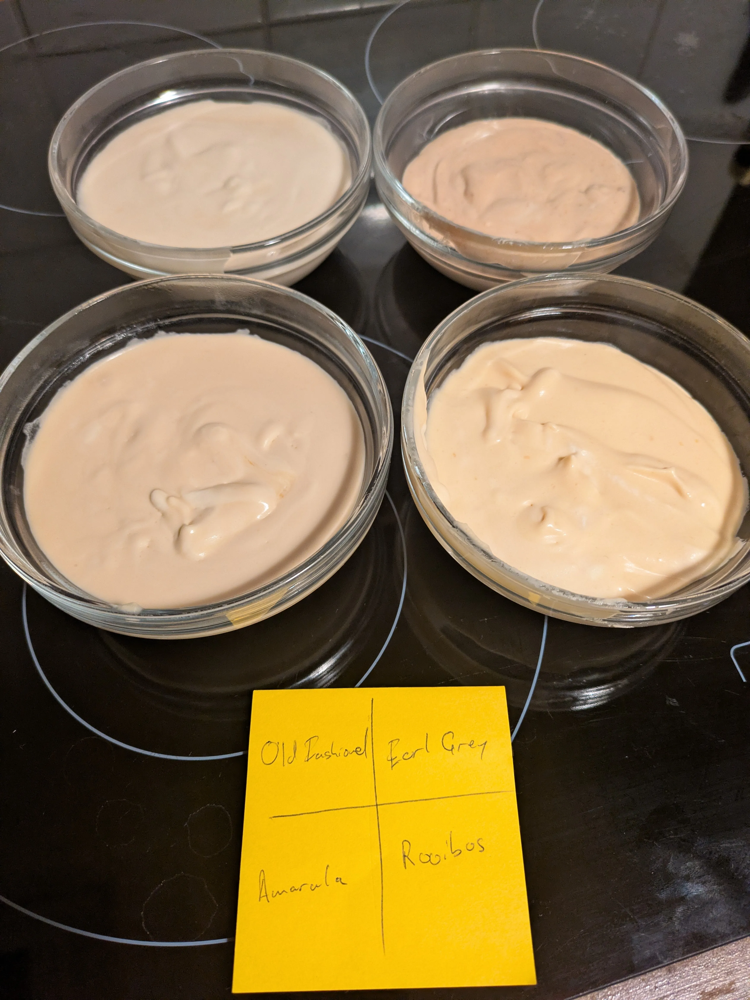

I had some ideas for mousse cake flavours (I'm on a bit of a mousse cake fixation at the moment). 

I wanted to try out a few flavours without having to whip up large batches of mousse, so I wanted to try four different flavours I had in mind using 200g of cream. 

The four flavours I had in mind were: 
* Bourbon and Bitters (i.e. an old fashioned)
* Amarula
* Earl Grey Tea
* Rooibos Tea

So for each recipe, I went for 1 gelatin sheet for the teas, and 1.5 sheets for the alcohols. 

I whipped 200g of whipped cream, so I can use 50g for each mousse. 

## Bourbon & Bitters

**Ingredients:**
- 30 ml bourbon  
- 15 ml water  
- 20 g sugar  
- 3 dashes bitters    
- 1.5 sheets gelatin (bloomed)  
- 50 g whipped cream  

**Method:**
1. Heat water and sugar together until the sugar is dissolved.
2. Remove from heat. Add bourbon, bitters
3. Bloom the gelatin in cold water, squeeze out excess, and stir it into the warm mixture until fully dissolved.
4. Allow the mixture to cool to room temperature (but not set).
5. Gently fold in 50 g of whipped cream.

## Amarula

**Ingredients:**
- 40 ml Amarula  
- 10 ml milk  
- 10 g sugar  
- 1.5 sheets gelatin (bloomed)  
- 50 g whipped cream  

**Method:**
1. Warm the milk and sugar together until sugar is dissolved.
2. Take off the heat and add the bloomed gelatin, stirring until dissolved.
3. Stir in Amarula.
4. Cool to room temperature (not set), then gently fold in 50 g whipped cream.

## Earl Grey

**Ingredients:**
- 40 ml milk  
- 2 Earl Grey tea bags (or 4 g loose tea)  
- 15 g sugar  
- 1 sheet gelatin (bloomed)  
- 50 g whipped cream  

**Method:**
1. Heat milk to just below boiling.
2. Remove from heat, add tea, cover, and steep for 5 minutes.
3. Strain the tea-infused milk.
4. Stir in sugar and the bloomed gelatin until dissolved.
5. Cool to room temperature (not set), then gently fold in 50 g whipped cream.

## Rooibos

**Ingredients:**
- 40 ml milk  
- 2 rooibos tea bags (or 4 g loose)  
- 15 g sugar  
- 1 sheet gelatin (bloomed)  
- 50 g whipped cream  

**Method:**  
Same as for Earl Grey

## Results

All the mousses set well, and were all some variation on beige:

## Verdicts

**Bourbon & Bitters**: My least favourite of the bunch. I don't know if I used too much bitters, but I feel the flavours really clashed with the cream. I might do a follow up with only bourbon. 

**Amarula**: Pretty great. It's already a creamy liquor, so no wonder it goes well with cream. I might actually up the Amarula to 50ml, and skip the milk, especially if there is some other flavour in the cake. 

**Earl Grey**: Pretty good, but the bergamot is a bit too strong. I might rather do one tea bag for this amount of mousse. 

**Rooibos**: The stand out winner to me. I usually drink my Rooibos with milk, and this worked perfectly.  

## Conclusions

I am a little disappointed that Bourbon & Bitters was that bad, I wanted to make an Old Fashioned mousse cake, but that just won't do. Back to the drawing board.

The Amarula, unsurprisingly was delicious. But what to pair it with? Can actually make an Amarula mousse with Rooibos jelly? Amarula and vanilla is also probably fine. Coffee is always a winner. 

The Earl Grey was good, but a little bit overpowering. I found [this recipe](https://www.sogoodmagazine.com/pastry-recipes/raspberry-tea-earl-grey-by-elena-krasnova/) by someone who seems to know what they are doing and she was using less than half the amount of tea I was, so I think one tea bag would have been plenty. Maybe following the recipe above Earl Grey and raspberry? Or maybe orange? 

The Rooibos was just great. It was just the right strength. Rooibos goes well with vanilla, and also honey. It's a bit of a subtle flavour, so I might be a bit afraid by overwhelming it with citrus or tropical fruit. Rooibos mousse, vanilla sponge and honey jelly? But maybe you need that contrast. 
