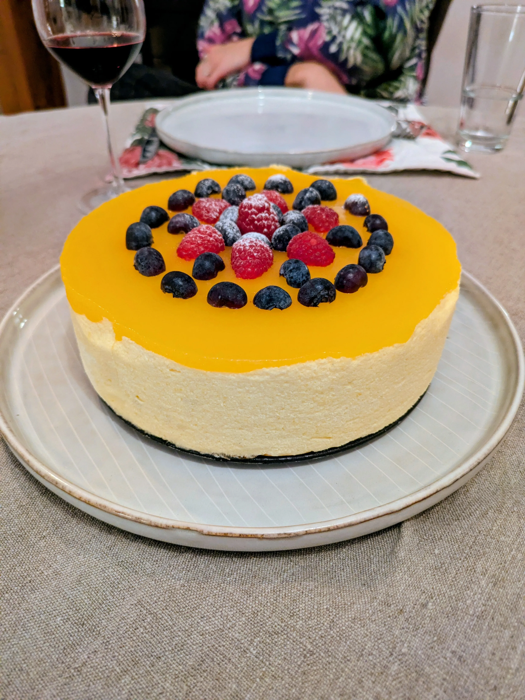
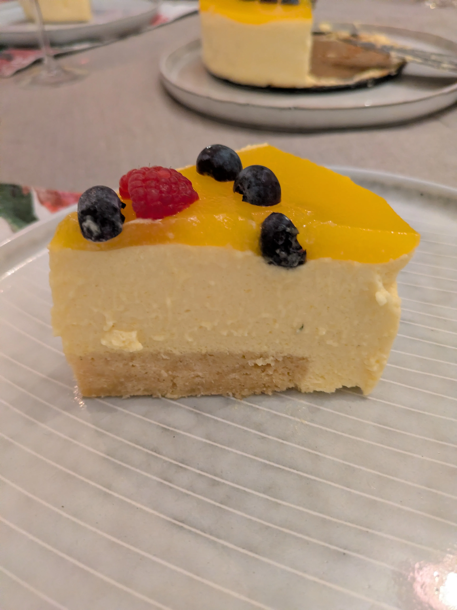
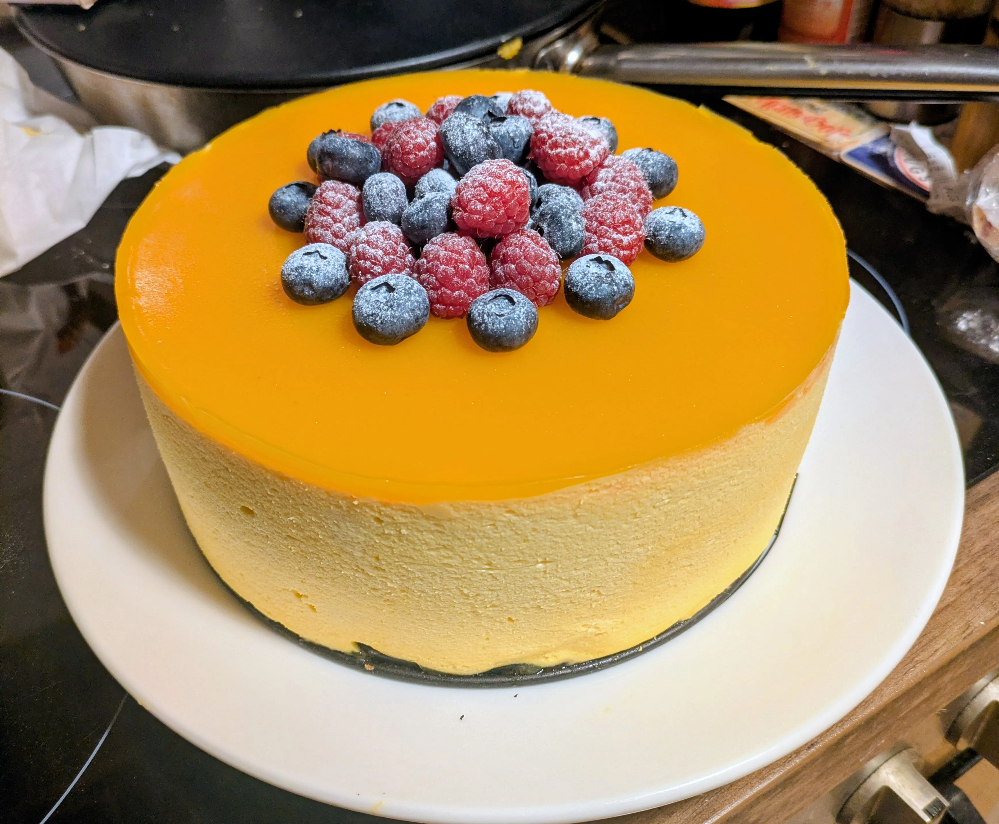
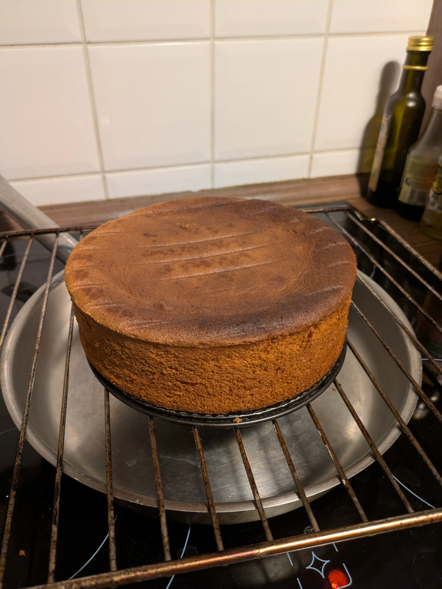
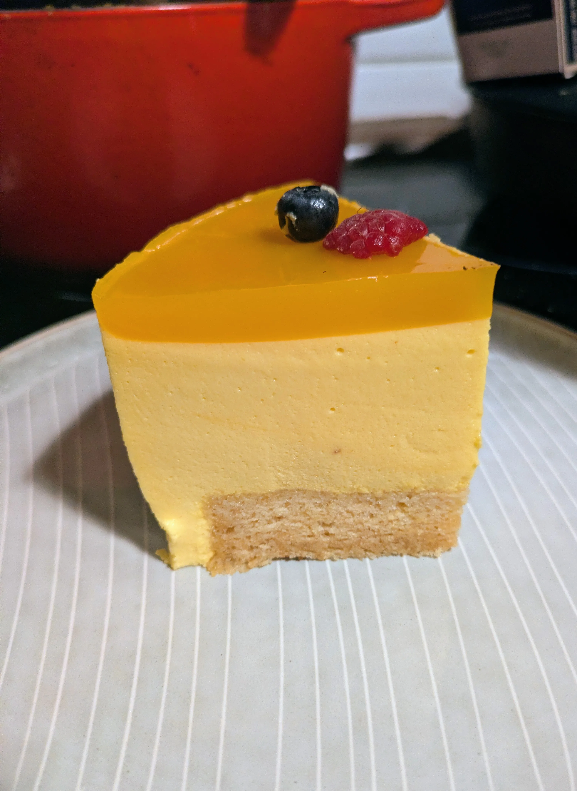

We got a stand mixer recently, and I wanted to have a go at making one of my favourite desserts, mousse cake!  

My sister in law made [this recipe](https://ashbaber.com/mango-mousse-cake/#mango-mousse-cake) by Ash Baber for us, and I wanted to give it a try myself.   

I made it twice, once on the one weekend and once one the following weekend. 

## First attempt

The first cake came out pretty well:

I used baking paper to line the springform pan (when pouring the mousse) as the recipe suggested, but I cut the edges off the cake to remove the browned parts, and also so it gets covered in mousse, i.e. becoming invisible until sliced: 

### Some notes

1. I used frozen mango pieces, which turned out not to be very flavourful, resulting in a mousse with a subtle mango flavour, instead of the intense mango flavour I was hoping for. 
2. I lined the sides of the springform pan with baking paper when baking the sponge, and it didn't rise properly. This sponge really needs to cling to the sides to rise properly. The original recipe mentions this, but I got my wires crossed there. 
3. Using baking paper when pouring the mousse results in decently, but not exceptionally smooth sides, as the paper tends to wrinkle easily. Something more stiff would be more neater. 

So to improve on this I made a few changes for the second attempt. 

## Second attempt

For the second cake I used mango pulp instead of frozen pieces, I did not line the sides of the tin with baking paper while making the sponge, and I used acetate sheets instead of baking paper for pouring the mousse, and it turned out quite a bit better than before: 

The acetate sheets really give the cake a clean, neat look that looks really impressive. 

The cake rose really well this time, although it did deflate a lot under the weight of the mousse. 

Here it is after baking:

and once incorporated into the cake: 

The flavour was amazing this time, with a really punchy mango taste. The advantage of using pulp is that I also didn't need to blend the mangoes myself. If you live in a place where you can reliably find fresh mangoes that are actually ripe then using fresh ones would be great, but I'm sticking to canned for the foreseeable future. 

As the mango pulp comes sweetened (5% sugar according to the tin), I reduced the sugar I put into the mousse and jelly from 120g to 80g for the mousse (100g would probably be closer to the original recipe, but I don't like my cakes very sweet), and from 50g to 40g for the jelly. 

## Decoration

In both cases I decorated with blueberries and raspberries. I think the second cake, with its pile of berries looks best. 

I dusted them with a bit of powdered sugar right before serving. The powdered sugar melts into the jelly, so becomes invisible immediately, making the berries really stand out.  

I might try fresh mango slices in the future. 

## Things to try

* Add a second layer of sponge inside the cake
* Add a layer of jelly inside the cake
* Infuse the sponge with mango juice/essence

